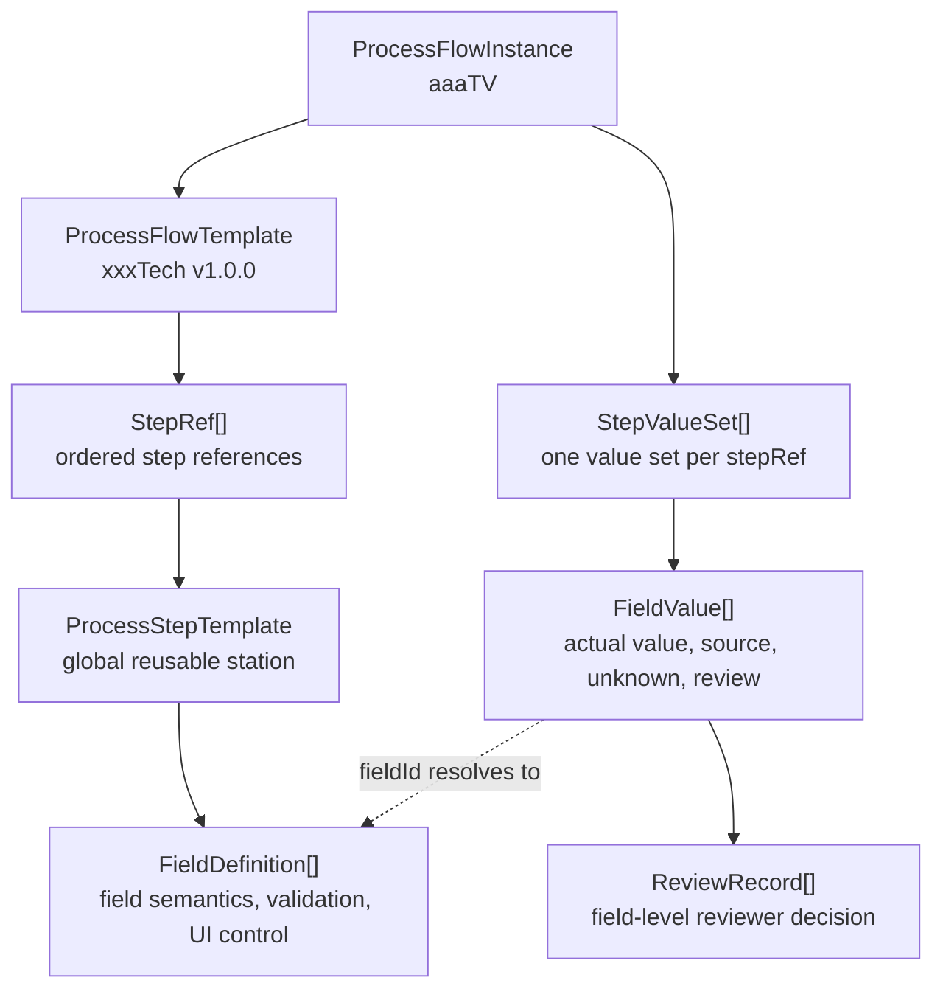

# Process Flow PoC Development Document

## 1. 文件目的

本文件記錄 Process Flow PoC 的技術規格與資料契約，涵蓋資料模型、UI workflow、validation rules、JSON export shape 與 acceptance criteria。

## 2. Product Shape

V1 是一個 template/instance workspace。

- 全域 `ProcessStepTemplate` 定義可共用 process station，例如 molding、underfill、die attach。
- Process flow template 定義封裝技術平台的標準 flow，例如 xxxTech，並透過 step refs 引用 global step template。
- TV/Product instance 綁定 process flow template version，例如 aaaTV 使用 xxxTech v1.0.0。
- Simulation engineer 在 instance 中填入站點 value、source、assumption、unknown 與 attachment references。
- Integration reviewer 針對 required 或 review-required fields 留下 review status 與 comment。

V1 採 static web app 形態，資料存在 browser `localStorage`，並提供 JSON export。PoC 不依賴 package installation、DB 或企業系統串接。

## 3. Core Governance Rules

- Process step template 是 global object，不屬於單一 process flow template。
- Process flow template 只定義站點引用與順序，field 不填入 value。
- Published template 是不可變的已發布快照；若變更會影響既有 instance 的語意、validation 結果、required 欄位、站點組成或流程順序，必須建立新 version，而不是覆寫原 version。
- Process flow instance 建立後預設鎖定建立時的 process flow template version；
- Process flow template 或 Process step template published 後，原則上不直接修改既有 version；例外修改僅限需要修正已發布內容，且必須明確標記對既有 instance 的影響與更新要求。
- Published template 例外修改的 instance update handling 仍屬待討論治理規則，可能模式如下：
    1. Template 補述或 bug fix：觸發 `force update required`。Instance owner 在下一次使用該 instance 時必須完成 lazy update，完成後才能繼續後續流程。
    2. 製程優化或 template 行為更改：由 process template owner 判斷影響程度，選擇 `force update required` 或 `warning optional update`。前者要求 instance owner 更新後才能繼續流程；後者提示 instance owner 有新版可用，由 instance owner 決定是否更新。
- Field definition 只描述欄位語意與行為；instance value field 才保存特定 TV/Product 的實際值。

## 4. Data Model

### 4.1 資料模型總覽

本章可以先用一個實際 process lifecycle 來理解資料結構關係。核心原則是：template 定義「可以填什麼與如何驗證」，instance 保存「某個 TV/Product 實際填了什麼、來源是什麼、審核結果是什麼」。

以 `aaaTV` 使用 `xxxTech v1.0.0` 為例：

1. Integration/platform owner 建立全域 `ProcessStepTemplate`，例如 `Molding / Encapsulation`。它代表一個可重複使用的 process station。
2. `ProcessStepTemplate.fieldDefinitions[]` 直接內嵌多個 `FieldDefinition`，例如 `mold_material`、`mold_thickness`、`post_mold_stack_thickness`。`FieldDefinition` 只描述欄位語意、value type、UI control、validation、reference 或 computed rule，不保存任何產品實際值。
3. Flow owner 建立 `ProcessFlowTemplate`，例如 `xxxTech v1.0.0`。Flow template 不複製欄位、不填 value，只用 `stepRefs[]` 引用已發布的 process step template version，並決定站點順序。
4. Simulation engineer 建立 `ProcessFlowInstance`，例如 `aaaTV` instance。Instance 綁定並鎖定 `processFlowTemplateId` 與 `processFlowTemplateVersion`，避免 template 後續變更靜默影響既有資料。
5. 系統依 instance 綁定的 flow template resolve `stepRefs[]`，並在 instance 中建立對應的 `StepValueSet[]`。每個 `StepValueSet` 對應 flow 裡的一個 `stepRefId`。
6. 使用者在某個 `StepValueSet.fieldValues[]` 中填入 `FieldValue`。`FieldValue.fieldId` 指向該 step template version 中的 `FieldDefinition.id`，而 `FieldValue.value` 的形狀由該 definition 的 `valueType` 決定。
7. 使用者或系統也在 `FieldValue` 上保存 `source`、`assumption`、`unknown`、`attachmentRefs`。Integration reviewer 將審核結果寫入同一個 `FieldValue.reviewRecords[]`。



關係讀法：

- `ProcessStepTemplate -> FieldDefinition`：定義單一 station 有哪些欄位，以及每個欄位如何輸入、驗證、審核。
- `ProcessFlowTemplate -> StepRef -> ProcessStepTemplate`：定義一條 package technology flow 由哪些 station 組成，以及站點順序。
- `ProcessFlowInstance -> StepValueSet -> FieldValue`：保存某個 TV/Product 在每個 station 的實際填值。
- `FieldValue -> FieldDefinition`：透過 `fieldId` 回到欄位定義，決定 value shape、validation、reference 與 UI 行為。
- `ReviewRecord`：掛在 `FieldValue` 上，表示 reviewer 對該欄位值的結論，不代表整個 instance lifecycle。

### 4.2 ProcessStepTemplate

代表站點層級 process step。

必要欄位：

1. `id`
2. `version`
3. `name`
4. `categoryId`：指向 top-level `processStepTemplateCategories[].id`。Category 是給 UI 搜尋、瀏覽與建立 template 時使用的主要分類，不代表 flow 順序，也不取代 `FieldDefinition.scope`。
5. `purpose`
6. `owner`
7. `status`
8. `fieldDefinitions`： 用於描述此process step所需要的參數有哪些，每個參數 definition 以 FieldDefinition 結構來描述，其包含 `id`、`label`、`scope`、`valueType`、`controlType` 等欄位。 
    - 此處，FieldDefinition 是直接在 fieldDefinitions 中被使用 (非透過 id 間接 ref)
    - 欄位使用 `scope` 區分語意：
      - `inputState` 描述進入此站點前，上游已形成且此站點需要知道的狀態，例如進 molding 前的 stack thickness、die placement state、substrate warpage baseline。它不是此站點產生的結果，也不是此站點的 recipe parameter。
      - `outputState` 描述該站點完成後形成的 package/process state。
      - `processParameter` 描述影響該站點結果的 process parameters 或 recipe choices。

典型 step template 例子：

1. Molding / Encapsulation：描述 mold compound、mold thickness、cure condition。
2. Underfill：描述 underfill material、dispense pattern、cure profile。
3. Die attach：描述 attach material、bondline thickness、placement condition。

ProcessStepTemplate JSON 範本：

<details>
<summary>展開查看 ProcessStepTemplate JSON 範本</summary>

```json
{
  "id": "step_tpl_bonding_micro_bump",
  "version": "1.0.0",
  "name": "Micro bump bonding",
  "categoryId": "bonding.micro_bump",
  "purpose": "Define micro bump bonding process parameters and resulting bonded package state.",
  "owner": "integration.platform",
  "status": "draft",
  "fieldDefinitions": [
    {
      "id": "incoming_pad_finish",
      "label": "Incoming pad finish",
      "description": "Pad finish before micro bump bonding starts.",
      "scope": "inputState",
      "valueType": "string",
      "controlType": "select",
      "selectionMode": "single",
      "unit": null,
      "required": true,
      "reviewRequired": true,
      "optionSource": {
        "type": "static",
        "options": [
          {
            "value": "cu",
            "label": "Cu"
          },
          {
            "value": "ni_au",
            "label": "Ni/Au"
          }
        ]
      }
    },
    {
      "id": "bump_pitch",
      "label": "Bump pitch",
      "description": "Nominal micro bump pitch used by this bonding process.",
      "scope": "processParameter",
      "valueType": "float",
      "controlType": "number",
      "unit": "um",
      "required": true,
      "reviewRequired": true,
      "validation": {
        "min": 0
      }
    },
    {
      "id": "bonding_profile",
      "label": "Bonding profile",
      "description": "Named bonding recipe or process profile family.",
      "scope": "processParameter",
      "valueType": "string",
      "controlType": "select",
      "selectionMode": "single",
      "unit": null,
      "required": false,
      "reviewRequired": false,
      "optionSource": {
        "type": "static",
        "options": [
          {
            "value": "baseline_thermal_compression",
            "label": "Baseline thermal compression"
          },
          {
            "value": "low_temperature",
            "label": "Low temperature"
          }
        ]
      }
    },
    {
      "id": "post_bond_alignment_error",
      "label": "Post-bond alignment error",
      "description": "Measured or expected alignment error after bonding.",
      "scope": "outputState",
      "valueType": "float",
      "controlType": "number",
      "unit": "um",
      "required": false,
      "reviewRequired": true,
      "validation": {
        "min": 0
      }
    }
  ]
}
```

</details>

### 4.3 FieldDefinition

代表 step template 中的欄位定義。`FieldDefinition` 只描述欄位語意、資料型別、輸入控制、限制與 review requirement，不保存任何 TV/Product instance 的實際值。

欄位與行為規則：

1. `id`：欄位定義 ID，在同一個 step template version 內不可重複。
2. `label`：UI 顯示名稱，給 simulation engineer 與 reviewer 閱讀。
3. `description`：欄位語意說明，應描述這個欄位代表什麼 process state 或 parameter、何時使用、避免哪些誤解。
4. `scope`：欄位在站點中的語意分組。支援值為 `inputState`、`outputState`、`processParameter`。
5. `valueType`：欄位值的 domain 型別，定義 instance value 可接受的資料形態。支援值為 `string`、`integer`、`float`、`boolean`、`material`、`layoutReference`、`geometryReference`、`fieldGroupArray`，以及 array value type：`string[]`、`integer[]`、`float[]`。
6. `controlType`：此欄位在 UI 表現方式。支援值為 `text`、`number`、`checkbox`、`select`、`referenceSelect`、`computed`、`repeater`。
7. `selectionMode`：選項型 UI 的選取模式，只描述 UI 是單選或多選，不改變 value shape。`checkbox`、`select`、`referenceSelect` 可使用 `single` 或 `multiple`；非選項型欄位使用 `null` 或省略。`selectionMode: "single"` 必須搭配非 array `valueType`；`selectionMode: "multiple"` 必須搭配 array `valueType`。
8. `unit`：欄位的 canonical unit；`integer` 或 `float` 欄位若有單位應使用此欄位，無單位欄位使用 `null`，不要使用空字串。
9. `required`：instance 是否必須提供此欄位的 value 或明確標記 `unknown: true`。
10. `reviewRequired`：此欄位是否需要 integration reviewer approval 才算完成。
11. `validation`：欄位限制規則，例如 `min`、`max`、`exclusiveMin`、`exclusiveMax`、`regex`、`maxLength`、`allowedUnits`。
12. `optionSource`：`select` 或選項型 `checkbox` 的 primitive 選項來源，可為 static options 或外部 primitive option catalog。`optionSource` 不用於 `referenceSelect`。
13. `reference`：`material`、`layoutReference`、`geometryReference` 等 reference 類欄位的外部 entity 來源 metadata (DB位置)；V1 不直接串接公司系統。
14. `derivedRule`：`computed` 欄位的計算規則。V1 PoC 會在前端依 `derivedRule` 計算結果，但只支援受限公式語法，不執行任意 JavaScript。
15. `repeatDefinition`：`repeater` 欄位的重複群組定義。用於 RDL build-up 這類需要在單一欄位內建立多組 PM + RDL repeat items 的情境；repeat item 數量由 `fieldGroupArray.value.items.length` 表示。

Control type behavior：

| `controlType` | UI 行為 | 對應 `valueType` | 必要或常用設定 |
| --- | --- | --- | --- |
| `text` | 文字輸入框，只能輸入文字。 | `string` | 可用 `validation.regex`、`minLength`、`maxLength` 限制格式與長度。 |
| `number` | 數字輸入框。 | `integer` 或 `float` | `integer` 不允許小數；`float` 可允許小數。用 `validation` 控制範圍。 |
| `checkbox` | 單一 yes/no 核取方塊，或多個核取方塊直接展開在畫面上。 | `boolean`、`string`、`string[]`、`integer[]`、`float[]` | 單一 yes/no checkbox 使用 `boolean`；選項型 checkbox 使用 `selectionMode` 與 `optionSource.options`，多選時使用 array `valueType`。 |
| `select` | 下拉選單或 compact list。 | `string`、`integer`、`float`、`string[]`、`integer[]`、`float[]` | 使用 `selectionMode` 控制單選或多選，選項放在 `optionSource.options`；多選時使用 array `valueType`。 |
| `referenceSelect` | 從外部 DB/ref 來源挑選 entity。 | `material`、`layoutReference`、`geometryReference`、`material[]`、`layoutReference[]`、`geometryReference[]` | 使用 `reference` 描述來源，V1 UI 可用 `reference.mockOptions` 模擬外部選項；多選時使用 array `valueType`。 |
| `computed` | 唯讀計算結果，由前端依公式更新。 | `integer`、`float`、`string`、`boolean` | 必須提供 `derivedRule`。Instance value 由系統計算，不由使用者手動輸入。 |
| `repeater` | 在單一欄位中動態新增、縮減或移除多組子欄位。 | `fieldGroupArray` | 必須提供 `repeatDefinition`；`itemFieldDefinitions[]` 定義每個 repeat item 內的 child fields，`minItems` 與 `maxItems` 可限制 `items.length`。 |

Numeric validation 使用 `min`、`max`、`exclusiveMin`、`exclusiveMax` 表達大小限制：

| 語意 | `validation` |
| --- | --- |
| `> 0` | `{ "min": 0, "exclusiveMin": true }` |
| `>= 0` | `{ "min": 0 }` |
| `< 0` | `{ "max": 0, "exclusiveMax": true }` |
| `<= 0` | `{ "max": 0 }` |

Option source 規則：

- `optionSource` 描述 primitive 選項來源，適用於 `controlType: "select"` 與選項型 `controlType: "checkbox"`。
- `optionSource` 的格式為 `{ "type": "static" | "externalReference", "options"?: Option[], "sourceId"?: string }`。
- `Option` 的格式為 `{ "value": string | number, "label": string, "description"?: string, "disabled"?: boolean }`。
- `type: "static"` 時，`options` 必填；`type: "externalReference"` 時，`sourceId` 必填，`options` 可作為 V1 mock options、cache 或 fallback。
- `externalReference` 在 `optionSource` 中代表外部 primitive option catalog，不代表 `ReferenceDefinition`，也不保存外部 entity identity。
- 每個 option 必須有唯一 `value`，並應提供給 UI 顯示的 `label`。
- `option.value` 必須符合 `valueType` 的 primitive 型別；例如 `valueType: "string"` 或 `valueType: "string[]"` 使用 string option value，`valueType: "integer"` 或 `valueType: "integer[]"` 使用 integer number option value。
- `selectionMode: "single"` 時，`valueType` 必須是非 array 型別，instance `value` 保存單一 option value。
- `selectionMode: "multiple"` 時，`valueType` 必須是 array 型別，instance `value` 保存 option value array。
- Instance value 必須存在於 `optionSource.options[].value`；若使用 `externalReference` 且沒有本地 `options`，則由外部 option catalog 驗證。

Reference select 規則：

- `reference` 描述外部或共用 entity 來源，例如 material DB、layout repository 或 geometry library。
- `referenceSelect` 與 `optionSource` 的差異在於，`optionSource` 選的是 primitive value，例如字串或數字；`referenceSelect` 選的是具有穩定 identity 的外部 entity。
- `reference` 的作用是限制可選來源與 entity 類型，並讓 instance value 保留 traceability。下游流程可透過 `sourceId`、`entityType`、`entityId` 查回材料性質、layout metadata 或 geometry shape。
- Reference 欄位適合用於 mold compound、PM material、layout block、geometry feature 等需要追溯外部資料物件的欄位；不適合只代表固定文字選項的欄位。
- V1 前端 PoC 不需要真的串接外部 DB，但應在 `reference.mockOptions` 放可選假資料，讓 UI 可展示選擇流程。
- `selectionMode: "single"` 時，`valueType` 使用 `material`、`layoutReference` 或 `geometryReference`，instance `value` 保存單一 `ReferenceValue`。
- `selectionMode: "multiple"` 時，`valueType` 使用 `material[]`、`layoutReference[]` 或 `geometryReference[]`，instance `value` 保存 `ReferenceValue[]`。

FieldDefinition 與 value 範例：

單選 static select：

```json
{
  "id": "incoming_pad_finish",
  "label": "Incoming pad finish",
  "description": "Pad finish before micro bump bonding starts.",
  "scope": "inputState",
  "valueType": "string",
  "controlType": "select",
  "selectionMode": "single",
  "unit": null,
  "required": true,
  "reviewRequired": true,
  "optionSource": {
    "type": "static",
    "options": [
      {
        "value": "cu",
        "label": "Cu"
      },
      {
        "value": "ni_au",
        "label": "Ni/Au"
      }
    ]
  }
}
```

多選 checkbox：

```json
{
  "id": "mold_risk_flags",
  "label": "Mold risk flags",
  "description": "Visible checkbox group for risk tags that should be considered during integration review.",
  "scope": "processParameter",
  "valueType": "string[]",
  "controlType": "checkbox",
  "selectionMode": "multiple",
  "unit": null,
  "required": false,
  "reviewRequired": false,
  "optionSource": {
    "type": "static",
    "options": [
      {
        "value": "void_risk",
        "label": "Void risk"
      },
      {
        "value": "cte_mismatch",
        "label": "CTE mismatch"
      }
    ]
  }
}
```

```json
{
  "fieldId": "mold_risk_flags",
  "value": ["void_risk", "cte_mismatch"]
}
```

多選 numeric select：

```json
{
  "id": "qualified_reflow_temperatures",
  "label": "Qualified reflow temperatures",
  "description": "Qualified peak reflow temperatures for this process window.",
  "scope": "processParameter",
  "valueType": "integer[]",
  "controlType": "select",
  "selectionMode": "multiple",
  "unit": "degC",
  "required": false,
  "reviewRequired": false,
  "optionSource": {
    "type": "static",
    "options": [
      {
        "value": 245,
        "label": "245 degC"
      },
      {
        "value": 260,
        "label": "260 degC"
      }
    ]
  }
}
```

```json
{
  "fieldId": "qualified_reflow_temperatures",
  "value": [245, 260]
}
```

單選 referenceSelect：

```json
{
  "id": "mold_material",
  "label": "Mold compound",
  "description": "Mold compound used by this molding station. The value should point to a material reference, not a free-text material name.",
  "scope": "outputState",
  "valueType": "material",
  "controlType": "referenceSelect",
  "selectionMode": "single",
  "unit": null,
  "required": true,
  "reviewRequired": true,
  "reference": {
    "sourceType": "dbReference",
    "sourceId": "material_db",
    "entityType": "mold_compound",
    "mockOptions": [
      {
        "referenceType": "material",
        "sourceId": "material_db",
        "entityType": "mold_compound",
        "entityId": "MC-001",
        "displayName": "Baseline low-warpage mold compound"
      }
    ]
  }
}
```

```json
{
  "fieldId": "mold_material",
  "value": {
    "referenceType": "material",
    "sourceId": "material_db",
    "entityType": "mold_compound",
    "entityId": "MC-001",
    "displayName": "Baseline low-warpage mold compound"
  }
}
```

多選 referenceSelect：

```json
{
  "id": "candidate_mold_materials",
  "label": "Candidate mold compounds",
  "description": "Candidate mold compounds under review for this package.",
  "scope": "processParameter",
  "valueType": "material[]",
  "controlType": "referenceSelect",
  "selectionMode": "multiple",
  "unit": null,
  "required": false,
  "reviewRequired": true,
  "reference": {
    "sourceType": "dbReference",
    "sourceId": "material_db",
    "entityType": "mold_compound",
    "mockOptions": [
      {
        "referenceType": "material",
        "sourceId": "material_db",
        "entityType": "mold_compound",
        "entityId": "MC-001",
        "displayName": "Baseline low-warpage mold compound"
      },
      {
        "referenceType": "material",
        "sourceId": "material_db",
        "entityType": "mold_compound",
        "entityId": "MC-002",
        "displayName": "High modulus mold compound"
      }
    ]
  }
}
```

```json
{
  "fieldId": "candidate_mold_materials",
  "value": [
    {
      "referenceType": "material",
      "sourceId": "material_db",
      "entityType": "mold_compound",
      "entityId": "MC-001",
      "displayName": "Baseline low-warpage mold compound"
    },
    {
      "referenceType": "material",
      "sourceId": "material_db",
      "entityType": "mold_compound",
      "entityId": "MC-002",
      "displayName": "High modulus mold compound"
    }
  ]
}
```

Computed field 規則：

- `controlType: "computed"` 的欄位必須提供 `derivedRule`。
- V1 使用受限公式表示法：`expression` 可引用 `inputs[].alias`，支援 `+`、`-`、`*`、`/`、括號，以及白名單函數 `min`、`max`、`abs`、`round`。
- `derivedRule.inputs[]` 每一筆需定義 `fieldId` 與公式中使用的 `alias`。
- 前端 PoC 應在 input field 改變時重新計算 computed field，並將計算結果寫入 export JSON 的 `FieldValue.value`。

Repeatable field group 規則：

- `controlType: "repeater"` 必須搭配 `valueType: "fieldGroupArray"` 與 `repeatDefinition`。
- `repeatDefinition.itemFieldDefinitions[]` 使用完整 `FieldDefinition` shape，描述每一個 repeat item 內會出現的 child fields。
- Repeat item 數量由 `fieldGroupArray.value.items.length` 表示，不另外建立或保存 count `FieldDefinition`。
- Child field id 只需要在同一個 `repeatDefinition.itemFieldDefinitions[]` 內唯一；實際 resolve path 使用 parent field id、item index 與 child field id，例如 `rdl_layers[1].pm_thickness`。
- UI 遇到 `repeater` 欄位時，應在該欄位內提供 repeat count 操作介面，例如 number input、stepper、add item/remove item controls。此 count control 只是操作 `items[]` 的 UI，不輸出為獨立 `FieldValue`。
- 當使用者將 count 設為 `N` 時，UI 應讓 `fieldGroupArray.value.items.length` 等於 `N`，並依 `repeatDefinition.itemFieldDefinitions[]` 建立或移除 repeat items。新增 item 應產生穩定 `itemId`、依 `indexBase` 設定 `index`，並建立對應 child `FieldValue[]`。
- 縮減 item 數量時，UI 應提醒使用者會移除超出新 count 的 child field values。
- `repeatDefinition.minItems` 與 `repeatDefinition.maxItems` 可限制 `fieldGroupArray.value.items.length`。
- Parent `repeater` field 的 `reviewRequired` 通常只代表 repeat group 整體是否需要 reviewer sign-off；每個 child field 是否需要 review 仍由 child `FieldDefinition.reviewRequired` 決定。

RDL repeatable field group 範例：

<details>
<summary>展開查看 RDL repeatable field group JSON 範例</summary>

```json
[
  {
    "id": "rdl_layers",
    "label": "RDL layers",
    "description": "Repeatable PM + RDL layer definitions. The number of RDL layers is represented by rdl_layers.value.items.length.",
    "scope": "processParameter",
    "valueType": "fieldGroupArray",
    "controlType": "repeater",
    "unit": null,
    "required": true,
    "reviewRequired": false,
    "repeatDefinition": {
      "itemLabelTemplate": "RDL layer {{index}}",
      "indexBase": 1,
      "minItems": 1,
      "maxItems": 12,
      "itemFieldDefinitions": [
        {
          "id": "pm_material",
          "label": "PM material",
          "description": "Photo-material used before this RDL layer.",
          "scope": "processParameter",
          "valueType": "material",
          "controlType": "referenceSelect",
          "selectionMode": "single",
          "unit": null,
          "required": true,
          "reviewRequired": true,
          "reference": {
            "sourceType": "dbReference",
            "sourceId": "material_db",
            "entityType": "photo_material",
            "mockOptions": []
          }
        },
        {
          "id": "pm_thickness",
          "label": "PM thickness",
          "description": "Photo-material thickness for this layer.",
          "scope": "processParameter",
          "valueType": "float",
          "controlType": "number",
          "unit": "um",
          "required": true,
          "reviewRequired": true,
          "validation": {
            "min": 0
          }
        },
        {
          "id": "rdl_thickness",
          "label": "RDL thickness",
          "description": "Copper RDL thickness for this layer.",
          "scope": "processParameter",
          "valueType": "float",
          "controlType": "number",
          "unit": "um",
          "required": true,
          "reviewRequired": true,
          "validation": {
            "min": 0
          }
        }
      ]
    }
  }
]
```

</details>

`fieldGroupArray` instance value 範例：

<details>
<summary>展開查看 fieldGroupArray instance value JSON 範例</summary>

```json
{
  "fieldId": "rdl_layers",
  "value": {
    "items": [
      {
        "itemId": "rdl_layer_1",
        "index": 1,
        "label": "RDL layer 1",
        "fieldValues": [
          {
            "fieldId": "pm_material",
            "value": {
              "referenceType": "material",
              "sourceId": "material_db",
              "entityType": "photo_material",
              "entityId": "PM-001",
              "displayName": "Baseline photo-material"
            },
            "source": {
              "type": "materialDb",
              "ref": "material_db:PM-001",
              "label": "Material DB PM-001"
            },
            "assumption": null,
            "unknown": false,
            "attachmentRefs": [],
            "reviewRecords": []
          },
          {
            "fieldId": "pm_thickness",
            "value": 8.5,
            "source": {
              "type": "spec",
              "ref": "RDL stack v0.1",
              "label": "RDL stack v0.1"
            },
            "assumption": null,
            "unknown": false,
            "attachmentRefs": [],
            "reviewRecords": []
          },
          {
            "fieldId": "rdl_thickness",
            "value": 3,
            "source": {
              "type": "spec",
              "ref": "RDL stack v0.1",
              "label": "RDL stack v0.1"
            },
            "assumption": null,
            "unknown": false,
            "attachmentRefs": [],
            "reviewRecords": []
          }
        ]
      },
      {
        "itemId": "rdl_layer_2",
        "index": 2,
        "label": "RDL layer 2",
        "fieldValues": [
          {
            "fieldId": "pm_material",
            "value": {
              "referenceType": "material",
              "sourceId": "material_db",
              "entityType": "photo_material",
              "entityId": "PM-002",
              "displayName": "Low-stress photo-material"
            },
            "source": {
              "type": "materialDb",
              "ref": "material_db:PM-002",
              "label": "Material DB PM-002"
            },
            "assumption": null,
            "unknown": false,
            "attachmentRefs": [],
            "reviewRecords": []
          },
          {
            "fieldId": "pm_thickness",
            "value": 7.5,
            "source": {
              "type": "spec",
              "ref": "RDL stack v0.1",
              "label": "RDL stack v0.1"
            },
            "assumption": null,
            "unknown": false,
            "attachmentRefs": [],
            "reviewRecords": []
          },
          {
            "fieldId": "rdl_thickness",
            "value": 2.5,
            "source": {
              "type": "spec",
              "ref": "RDL stack v0.1",
              "label": "RDL stack v0.1"
            },
            "assumption": null,
            "unknown": false,
            "attachmentRefs": [],
            "reviewRecords": []
          }
        ]
      }
    ]
  },
  "source": null,
  "assumption": null,
  "unknown": false,
  "attachmentRefs": [],
  "reviewRecords": []
}
```

</details>

`ValuePayload` 的形狀由 `valueType` 決定；`selectionMode` 只用來描述選項型 UI 的單選或多選行為：

| `valueType` | `selectionMode` | `ValuePayload` |
| --- | --- | --- |
| `string` | N/A 或 `single` | `string`；若提供 `optionSource`，必須存在於 `optionSource.options[].value` 或外部 option catalog。 |
| `string[]` | `multiple` | `string[]`；每個值都必須存在於 `optionSource.options[].value` 或外部 option catalog。 |
| `integer` | N/A 或 `single` | `number`，但不可有小數；若提供 `optionSource`，必須存在於 `optionSource.options[].value` 或外部 option catalog。 |
| `integer[]` | `multiple` | `number[]`，每個值都不可有小數，且必須存在於 `optionSource.options[].value` 或外部 option catalog。 |
| `float` | N/A 或 `single` | `number`，可有小數；若提供 `optionSource`，必須存在於 `optionSource.options[].value` 或外部 option catalog。 |
| `float[]` | `multiple` | `number[]`，每個值都可有小數，且必須存在於 `optionSource.options[].value` 或外部 option catalog。 |
| `boolean` | N/A | `boolean` |
| `material` | `single` 或 N/A | `ReferenceValue` |
| `material[]` | `multiple` | `ReferenceValue[]` |
| `layoutReference` | `single` 或 N/A | `ReferenceValue` |
| `layoutReference[]` | `multiple` | `ReferenceValue[]` |
| `geometryReference` | `single` 或 N/A | `ReferenceValue` |
| `geometryReference[]` | `multiple` | `ReferenceValue[]` |
| `fieldGroupArray` | N/A | `RepeatableGroupValue`，包含 `items[]`，每個 item 內保存一組 child `FieldValue[]`。 |

### 4.4 ProcessFlowTemplate

代表封裝技術平台的標準 process flow。Process flow template 不儲存 TV/Product 實際 value，也不直接定義欄位；它只引用 global step template 並決定站點順序。

必要欄位：

- `id`
- `name`
- `version`
- `description`
- `owner`
- `status`
- `stepRefs`

`id` 是系統識別碼、DB key 或不可變 reference key，用於 API、instance binding 與資料庫關聯，例如 `flow_tpl_cowos_l`。  

`name` 是人可讀的 package technology name，例如 `xxxTech`。UI、報表與 reviewer 溝通應顯示 `name`，但資料關聯應使用 `id`。  

`description` 描述此process flow technology用途

`stepRefs` 代表 process flow template 對 global step template 的引用清單。每一筆 `stepRefs[]` item 包含：
- `stepRefId`：此 process step 在此 prcess flow template 中的 ID
- `processStepTemplateId`：引用 process step template 的 global ID
- `processStepTemplateVersion`
- `enabled`

`stepRefs[]` array order 代表 process flow 的站點順序。`stepRefId` 是 flow 內穩定 reference，用於 instance value set、diff、migration 與 UI anchor；排序仍以 array order 為準。刪除或插入前段 step 時，不需要重排後續 step 的 numeric sort key。

`reviewPolicy` 是 optional flow-level policy。V1 預設不啟用 flow-level review policy，欄位是否需要審核主要由 `FieldDefinition.reviewRequired` 決定。

### 4.5 ProcessFlowInstance

代表特定 TV/Product 的 process flow。

必要欄位：

- `id`
- `productName`
- `lifecycleStatus`
- `processFlowTemplateId`
- `processFlowTemplateVersion`
- `stepValueSets`

必要設計：

- `processFlowTemplateId` 與 `processFlowTemplateVersion` 必須保存，且 `processFlowTemplateId` 指向 `ProcessFlowTemplate.id`。
- Instance 建立後鎖定 process flow template version。
- Process flow template 更新不自動改變既有 instance。
- Template version 升級必須由 owner 觸發 explicit migration/review workflow。
- Migration workflow 應讓 owner 選擇保留舊版、升級到新版，或批次強制升級並進行 review/確認。
- 批次強制升級仍然是 migration，不是靜默改寫既有 instance binding。即使是 bug fix 或補述，也應留下 migration/review 記錄。
- 只有純文字 typo、描述補充，且不影響 validation、required 狀態或資料解讀時，才可考慮 metadata-level correction。

### 4.6 StepValueSet and FieldValue

`StepValueSet` 代表某個 step ref 在 instance 中的實際填值集合。Step value set 只屬於某個 `ProcessFlowInstance`，不回寫 global step template 或 process flow template。

每個 `StepValueSet` 包含：

- `stepRefId`
- `processStepTemplateId`
- `processStepTemplateVersion`
- `fieldValues`

`stepRefId` 必須對應到 instance 綁定的 `ProcessFlowTemplate.stepRefs[].stepRefId`。`processStepTemplateId` 與 `processStepTemplateVersion` 是 export/debug 用的 denormalized snapshot，必須與 `stepRefId` resolve 結果一致。

Top-level `FieldValue.fieldId` 不是指向 global field definition library，而是指向該 `StepValueSet.stepRefId` resolve 出來的 step template version 內的 `fieldDefinitions[].id`。`fieldGroupArray` repeat item 內的 child `FieldValue.fieldId` 則指向 parent `FieldDefinition.repeatDefinition.itemFieldDefinitions[].id`。

每個 `FieldValue` 包含：

- `fieldId`
- `value`
- `source`
- `assumption`
- `unknown`
- `attachmentRefs`
- `reviewRecords`

Field value 行為：

- Top-level `fieldId` 必須對應到該 step template version 中存在的 `FieldDefinition.id`；repeat item child `fieldId` 必須對應到 parent `repeatDefinition.itemFieldDefinitions[].id`。
- `value` 必須符合對應 `FieldDefinition` 的 `valueType`、`controlType`、`unit`、`validation`、`optionSource`、`reference`、`derivedRule` 與 `repeatDefinition` 規則。
- `unknown: true` 表示目前值未知；此時 `value` 必須為 `null` 或不存在，但仍應保留 `source`、`assumption` 或 reviewer comment 說明未知原因。
- `assumption` 表示暫用假設，不等於已確認規格，也不等於 integration approval。
- `source` 記錄 value 來源，例如 spec、integration note、manual input、material DB reference 或 layout/geometry reference。
- `attachmentRefs` 只保存附件 reference；V1 不處理附件檔案本體。
- `reviewRecords` 保存 integration review status、reviewer、comment 與時間戳。

### 4.7 Supporting Nested Structures

`StepTemplateCategory` 描述 process step template 的集中式分類 registry。Process step template 只保存 `categoryId`，並透過 `categoryId` resolve 到這個 registry：

- `id`：穩定分類 ID，建議使用 dot-separated hierarchy，例如 `bonding.micro_bump` 或 `encapsulation.molding`。
- `label`：UI 顯示名稱，例如 `Micro bump`。
- `parentId`：上層 category ID；root category 使用 `null`。UI 可依 `parentId` 建立分類樹與 breadcrumb。
- `technologyFamily`：上層技術族群，例如 `bonding`、`encapsulation`、`assembly`。
- `description`：分類語意說明，協助 template owner 選擇正確 category。
- `tags`：可選搜尋關鍵字；用於補強搜尋，不取代 `categoryId`。

`ReviewPolicy` 描述 optional flow-level review policy。V1 預設不啟用；啟用時只放跨欄位規則，例如：

- `requiredFieldsNeedApproval`
- `unknownRequiresComment`

`ReferenceDefinition` 描述欄位允許引用的外部資料來源與 entity 類型。它定義「可以從哪裡選」，不是 instance 的實際值：

- `sourceType`：例如 `dbReference`、`fileReference`、`manualReference`。
- `sourceId`：例如 `material_db`、`layout_repo`。
- `entityType`：例如 `mold_compound`、`layout_block`、`geometry_feature`。
- `mockOptions`：V1 UI 用的假資料選項，格式為 `ReferenceValue[]`。正式串接外部 DB 後可由 API hydration 取代。

`OptionSource` 描述 checkbox/select 的 primitive 選項來源：

- `type`：`static` 或 `externalReference`。
- `options`：static options array；每筆 option 至少包含 `value` 與 `label`，可選 `description` 與 `disabled`。
- `sourceId`：當 `type` 是 `externalReference` 時，描述選項來源 ID。
- `type: "static"` 時，`options` 必填。
- `type: "externalReference"` 時，`sourceId` 必填，`options` 可作為 V1 mock options、cache 或 fallback。
- `option.value` 必須是 string 或 number，並符合對應 `valueType` 或 array item 的 primitive 型別。
- `optionSource` 不保存外部 entity identity；需要保存 entity identity 時應使用 `reference` 與 `ReferenceValue`。

`ReferenceValue` 描述 instance 實際引用到的外部 entity。它保存的是可追溯 identity，而不是純文字選項：

- `referenceType`：例如 `material`、`layout`、`geometry`。
- `sourceId`
- `entityType`
- `entityId`
- `displayName`

`SourceReference` 描述欄位值從哪裡來：

- `type`：例如 `spec`、`integrationNote`、`manualInput`、`materialDb`、`computed`。
- `ref`
- `label`

`AttachmentReference` 描述附件 reference：

- `type`：例如 `document`、`image`、`layoutFile`。
- `ref`
- `label`

`DerivedRule` 描述 computed field 的公式：

- `calculationType`：V1 使用 `formula`。
- `expression`：受限公式字串，只可引用 `inputs[].alias`。
- `inputs`：公式輸入欄位，每筆包含 `fieldId` 與 `alias`。
- `outputValueType`：公式輸出型別，例如 `integer` 或 `float`。
- `unit`：公式輸出單位。
- `recompute`：V1 使用 `onInputChange`，代表輸入值變動時重新計算。

`RepeatDefinition` 描述 repeatable field group 的展開規則：

- `itemLabelTemplate`：UI 顯示每一個 repeat item 的 label template，例如 `RDL layer {{index}}`。
- `indexBase`：repeat item index 的起始值。RDL layer 使用 `1`，讓 UI 與工程語言一致。
- `minItems`：可選，允許的最少 repeat item 數。
- `maxItems`：可選，允許的最多 repeat item 數。
- `itemFieldDefinitions`：每一個 repeat item 內要展開的 child `FieldDefinition[]`。

`RepeatableGroupValue` 描述 `fieldGroupArray` 的 instance value：

- `items`：repeat item array，長度即為此 repeatable field group 的 item count，並需符合 `repeatDefinition.minItems` 與 `repeatDefinition.maxItems`。
- `itemId`：repeat item 的穩定 ID，例如 `rdl_layer_1`。即使 UI reorder，也可用於 diff 與 review anchor。
- `index`：repeat item 的顯示順序，需符合 `repeatDefinition.indexBase`。
- `label`：可選，依 `itemLabelTemplate` 產生的人可讀 label。
- `fieldValues`：此 repeat item 內的 child `FieldValue[]`，其 `fieldId` resolve 到 `repeatDefinition.itemFieldDefinitions[].id`。

Supporting allowed values：

- `TemplateStatus`：`draft`、`published`、`deprecated`。
- `FieldScope`：`inputState`、`outputState`、`processParameter`。
- `ValueType`：`string`、`integer`、`float`、`boolean`、`material`、`layoutReference`、`geometryReference`、`fieldGroupArray`、`string[]`、`integer[]`、`float[]`、`material[]`、`layoutReference[]`、`geometryReference[]`。
- `ControlType`：`text`、`number`、`checkbox`、`select`、`referenceSelect`、`computed`、`repeater`。
- `SelectionMode`：`single`、`multiple`。
- `InstanceLifecycleStatus`：`draft`、`pendingIntegrationReview`、`approved`、`needsClarification`。

### 4.8 ReviewRecord

代表 integration review 紀錄。`ReviewRecord.status` 只表示 reviewer 對欄位值的結論，不代表整個 instance lifecycle。

狀態：

- `approved`
- `needsClarification`
- `rejected`
- `waived`

### 4.9 欄位對應資料結構

下表用 `欄位 path` 讓開發者可以直接看出某個欄位屬於哪個資料結構，以及欄位值應該使用什麼資料結構或型別。

本文件中的 `ProcessFlowExport` 指 V1 JSON export root object，也就是 JSON Shape 的最外層物件。

| 欄位 path | 對應資料結構 | 欄位值資料結構或型別 | 說明 |
| --- | --- | --- | --- |
| `processStepTemplateCategories` | `ProcessFlowExport` | `StepTemplateCategory[]` | 全域 process step template 分類 registry，供 template `categoryId` 參照。 |
| `processStepTemplates` | `ProcessFlowExport` | `ProcessStepTemplate[]` | Export 中包含的全域 process step template 清單。 |
| `processFlowTemplates` | `ProcessFlowExport` | `ProcessFlowTemplate[]` | 可發布的 package technology flow templates。 |
| `processFlowInstances` | `ProcessFlowExport` | `ProcessFlowInstance[]` | TV/Product 實際填值資料。 |
| `id` | `StepTemplateCategory` | `string` | 穩定分類 ID，例如 `bonding.micro_bump`。 |
| `label` | `StepTemplateCategory` | `string` | 分類顯示名稱，例如 `Micro bump`。 |
| `parentId` | `StepTemplateCategory` | `string \| null` | 上層分類 ID；root category 使用 `null`。 |
| `technologyFamily` | `StepTemplateCategory` | `string` | 上層技術族群，例如 `bonding`。 |
| `description` | `StepTemplateCategory` | `string` | 分類語意說明，協助 owner 選擇正確分類。 |
| `tags` | `StepTemplateCategory` | `string[]` | 可選搜尋 tags，不取代 `categoryId`。 |
| `id` | `ProcessStepTemplate` | `string` | Step template 的不可變識別碼。 |
| `version` | `ProcessStepTemplate` | `semver string` | Step template version。 |
| `name` | `ProcessStepTemplate` | `string` | 人可讀的站點名稱。 |
| `categoryId` | `ProcessStepTemplate` | `string` | 指向 `processStepTemplateCategories[].id`，用於分類瀏覽、篩選與搜尋。 |
| `purpose` | `ProcessStepTemplate` | `string` | 站點用途與建模意義。 |
| `owner` | `ProcessStepTemplate` | `string` | 負責維護此 template 的 team 或 role。 |
| `status` | `ProcessStepTemplate` | `TemplateStatus` | `draft`、`published` 或 `deprecated`。 |
| `fieldDefinitions` | `ProcessStepTemplate` | `FieldDefinition[]` | 此站點可填寫的完整欄位定義 object list，不是 field id list。 |
| `id` | `FieldDefinition` | `string` | 欄位定義 ID，在同一個 step template version 內不可重複。 |
| `label` | `FieldDefinition` | `string` | UI 顯示名稱。 |
| `description` | `FieldDefinition` | `string` | 欄位語意說明，協助開發者與 reviewer 理解用途。 |
| `scope` | `FieldDefinition` | `FieldScope` | `inputState`、`outputState` 或 `processParameter`。 |
| `valueType` | `FieldDefinition` | `ValueType` | 欄位值的 domain 型別。 |
| `controlType` | `FieldDefinition` | `ControlType` | UI 輸入控制型別。 |
| `selectionMode` | `FieldDefinition` | `SelectionMode \| null` | 選項型 UI 的選取模式；`single` 搭配非 array `valueType`，`multiple` 搭配 array `valueType`。 |
| `unit` | `FieldDefinition` | `string \| null` | Canonical unit；無單位欄位使用 `null`。 |
| `required` | `FieldDefinition` | `boolean` | Instance 是否必須填值或標記 unknown。 |
| `reviewRequired` | `FieldDefinition` | `boolean` | 此欄位是否需要 integration review approval。 |
| `validation` | `FieldDefinition` | `ValidationRule \| null` | integer、float、string 或 array item 的限制規則。 |
| `optionSource` | `FieldDefinition` | `OptionSource \| null` | select 或選項型 checkbox 的 primitive 選項來源。 |
| `reference` | `FieldDefinition` | `ReferenceDefinition \| null` | material、layout、geometry 等 reference 欄位的外部 entity 來源與可接受 entity 類型。 |
| `derivedRule` | `FieldDefinition` | `DerivedRule \| null` | `computed` 欄位的公式與輸入欄位 metadata。 |
| `repeatDefinition` | `FieldDefinition` | `RepeatDefinition \| null` | `repeater` 欄位的展開規則，用於在單一欄位內建立多組 child field definitions；repeat item 數量由 `fieldGroupArray.value.items.length` 表示。 |
| `id` | `ProcessFlowTemplate` | `string` | Flow template 的不可變識別碼。 |
| `name` | `ProcessFlowTemplate` | `string` | 人可讀的封裝技術平台名稱。 |
| `version` | `ProcessFlowTemplate` | `semver string` | Flow template version。 |
| `owner` | `ProcessFlowTemplate` | `string` | 負責維護此 flow template 的 team 或 role。 |
| `status` | `ProcessFlowTemplate` | `TemplateStatus` | `draft`、`published` 或 `deprecated`。 |
| `reviewPolicy` | `ProcessFlowTemplate` | `ReviewPolicy` | Optional，flow-level 審核政策。V1 預設不使用。 |
| `stepRefs` | `ProcessFlowTemplate` | `StepRef[]` | Flow 中的站點引用清單，array order 即站點順序。 |
| `stepRefId` | `StepRef` | `string` | Flow 內單一站點引用的穩定 ID，用於 instance value 對應。 |
| `processStepTemplateId` | `StepRef` | `string` | 指向 `ProcessStepTemplate.id`。 |
| `processStepTemplateVersion` | `StepRef` | `semver string` | 指向特定 `ProcessStepTemplate.version`。 |
| `enabled` | `StepRef` | `boolean` | 此站點是否出現在此 flow template 的預設流程中。 |
| `id` | `ProcessFlowInstance` | `string` | TV/Product instance ID。 |
| `productName` | `ProcessFlowInstance` | `string` | TV/Product 名稱。 |
| `lifecycleStatus` | `ProcessFlowInstance` | `InstanceLifecycleStatus` | `draft`、`pendingIntegrationReview`、`approved` 或 `needsClarification`。 |
| `processFlowTemplateId` | `ProcessFlowInstance` | `string` | 指向 `ProcessFlowTemplate.id`。 |
| `processFlowTemplateVersion` | `ProcessFlowInstance` | `semver string` | Instance 建立時鎖定的 flow template version。 |
| `stepValueSets` | `ProcessFlowInstance` | `StepValueSet[]` | 每個 flow step ref 的實際填值集合。 |
| `stepRefId` | `StepValueSet` | `string` | 指向 `ProcessFlowTemplate.stepRefs[].stepRefId`。 |
| `processStepTemplateId` | `StepValueSet` | `string` | Denormalized snapshot，需與 `stepRefId` resolve 結果一致。 |
| `processStepTemplateVersion` | `StepValueSet` | `semver string` | Denormalized snapshot，需與 `stepRefId` resolve 結果一致。 |
| `fieldValues` | `StepValueSet` | `FieldValue[]` | 此站點的欄位值集合。 |
| `fieldId` | `FieldValue` | `string` | 指向對應 step template version 中的 `FieldDefinition.id`。 |
| `value` | `FieldValue` | `ValuePayload \| null` | 實際填值，形狀由 `FieldDefinition.valueType` 決定。 |
| `source` | `FieldValue` | `SourceReference \| null` | 欄位值來源。 |
| `assumption` | `FieldValue` | `string \| null` | 暫用假設與理由。 |
| `unknown` | `FieldValue` | `boolean` | 是否明確標記目前未知。 |
| `attachmentRefs` | `FieldValue` | `AttachmentReference[]` | 附件 reference，不保存檔案本體。 |
| `reviewRecords` | `FieldValue` | `ReviewRecord[]` | 欄位層級審核紀錄。 |
| `status` | `ReviewRecord` | `ReviewStatus` | reviewer 對該欄位值的結論。 |
| `reviewer` | `ReviewRecord` | `string` | Reviewer team、role 或 user ID。 |
| `comment` | `ReviewRecord` | `string` | 審核意見。 |
| `reviewedAt` | `ReviewRecord` | `ISO-8601 datetime string` | 審核時間。 |

## 5. JSON Shape

<details>
<summary>展開查看完整 JSON Shape 範例</summary>

```json
{
  "processStepTemplateCategories": [
    {
      "id": "encapsulation.molding",
      "label": "Molding",
      "parentId": "encapsulation",
      "technologyFamily": "encapsulation",
      "description": "Encapsulation molding process step templates.",
      "tags": ["molding", "encapsulation", "mold_compound"]
    }
  ],
  "processStepTemplates": [
    {
      "id": "step_tpl_molding_encapsulation",
      "version": "1.0.0",
      "name": "Molding / Encapsulation",
      "categoryId": "encapsulation.molding",
      "purpose": "Define molded package state for downstream warpage and stress analysis.",
      "owner": "integration.platform",
      "status": "published",
      "fieldDefinitions": [
        {
          "id": "pre_mold_thickness",
          "label": "Pre-mold stack thickness",
          "description": "Total stack thickness before molding starts. Used as the incoming package state for mold thickness and warpage review.",
          "scope": "inputState",
          "valueType": "float",
          "controlType": "number",
          "unit": "um",
          "required": true,
          "reviewRequired": true,
          "validation": {
            "min": 0,
            "max": 2000
          }
        },
        {
          "id": "mold_material",
          "label": "Mold compound",
          "description": "Mold compound used by this molding station. The value should point to a material reference, not a free-text material name.",
          "scope": "outputState",
          "valueType": "material",
          "controlType": "referenceSelect",
          "selectionMode": "single",
          "unit": null,
          "required": true,
          "reviewRequired": true,
          "reference": {
            "sourceType": "dbReference",
            "sourceId": "material_db",
            "entityType": "mold_compound",
            "mockOptions": [
              {
                "referenceType": "material",
                "sourceId": "material_db",
                "entityType": "mold_compound",
                "entityId": "MC-001",
                "displayName": "Baseline low-warpage mold compound"
              },
              {
                "referenceType": "material",
                "sourceId": "material_db",
                "entityType": "mold_compound",
                "entityId": "MC-002",
                "displayName": "High modulus mold compound"
              }
            ]
          }
        },
        {
          "id": "mold_thickness",
          "label": "Mold thickness",
          "description": "Final molded thickness after this station. Used by downstream warpage, stress, and package outline assumptions.",
          "scope": "outputState",
          "valueType": "float",
          "controlType": "number",
          "unit": "um",
          "required": true,
          "reviewRequired": true,
          "validation": {
            "min": 0,
            "max": 2000
          }
        },
        {
          "id": "mold_cure_condition",
          "label": "Mold cure condition",
          "description": "Named cure condition or recipe family used by this molding station.",
          "scope": "processParameter",
          "valueType": "string",
          "controlType": "select",
          "selectionMode": "single",
          "unit": null,
          "required": false,
          "reviewRequired": false,
          "optionSource": {
            "type": "static",
            "options": [
              {
                "value": "baseline",
                "label": "Baseline"
              },
              {
                "value": "low-warpage",
                "label": "Low warpage"
              },
              {
                "value": "high-temperature",
                "label": "High temperature"
              }
            ]
          }
        },
        {
          "id": "mold_risk_flags",
          "label": "Mold risk flags",
          "description": "Visible checkbox group for risk tags that should be considered during integration review.",
          "scope": "processParameter",
          "valueType": "string[]",
          "controlType": "checkbox",
          "selectionMode": "multiple",
          "unit": null,
          "required": false,
          "reviewRequired": false,
          "optionSource": {
            "type": "static",
            "options": [
              {
                "value": "void_risk",
                "label": "Void risk"
              },
              {
                "value": "cte_mismatch",
                "label": "CTE mismatch"
              },
              {
                "value": "cure_profile_open",
                "label": "Cure profile not finalized"
              }
            ]
          }
        },
        {
          "id": "mold_process_note",
          "label": "Mold process note",
          "description": "Free-text note for context that does not fit a structured option.",
          "scope": "processParameter",
          "valueType": "string",
          "controlType": "text",
          "unit": null,
          "required": false,
          "reviewRequired": false,
          "validation": {
            "maxLength": 500
          }
        },
        {
          "id": "post_mold_stack_thickness",
          "label": "Post-mold stack thickness",
          "description": "Computed stack thickness after molding, calculated from pre-mold stack thickness and mold thickness.",
          "scope": "outputState",
          "valueType": "float",
          "controlType": "computed",
          "unit": "um",
          "required": false,
          "reviewRequired": false,
          "validation": {
            "min": 0,
            "max": 4000
          },
          "derivedRule": {
            "calculationType": "formula",
            "expression": "preMoldThickness + moldThickness",
            "inputs": [
              {
                "fieldId": "pre_mold_thickness",
                "alias": "preMoldThickness"
              },
              {
                "fieldId": "mold_thickness",
                "alias": "moldThickness"
              }
            ],
            "outputValueType": "float",
            "unit": "um",
            "recompute": "onInputChange"
          }
        }
      ]
    }
  ],
  "processFlowTemplates": [
    {
      "id": "flow_tpl_cowos_l",
      "name": "xxxTech",
      "version": "1.0.0",
      "owner": "integration.platform",
      "status": "published",
      "stepRefs": [
        {
          "stepRefId": "cowos_l_molding_encapsulation",
          "processStepTemplateId": "step_tpl_molding_encapsulation",
          "processStepTemplateVersion": "1.0.0",
          "enabled": true
        }
      ]
    }
  ],
  "processFlowInstances": [
    {
      "id": "inst_aaaTV",
      "productName": "aaaTV",
      "lifecycleStatus": "pendingIntegrationReview",
      "processFlowTemplateId": "flow_tpl_cowos_l",
      "processFlowTemplateVersion": "1.0.0",
      "stepValueSets": [
        {
          "stepRefId": "cowos_l_molding_encapsulation",
          "processStepTemplateId": "step_tpl_molding_encapsulation",
          "processStepTemplateVersion": "1.0.0",
          "fieldValues": [
            {
              "fieldId": "pre_mold_thickness",
              "value": 450.5,
              "source": {
                "type": "spec",
                "ref": "aaaTV pre-mold stack v0.2",
                "label": "aaaTV pre-mold stack v0.2"
              },
              "assumption": null,
              "unknown": false,
              "attachmentRefs": [],
              "reviewRecords": [
                {
                  "status": "approved",
                  "reviewer": "integration.platform",
                  "comment": "Pre-mold stack baseline confirmed for PoC sample.",
                  "reviewedAt": "2026-05-13T08:55:00+08:00"
                }
              ]
            },
            {
              "fieldId": "mold_material",
              "value": {
                "referenceType": "material",
                "sourceId": "material_db",
                "entityType": "mold_compound",
                "entityId": "MC-001",
                "displayName": "Baseline low-warpage mold compound"
              },
              "source": {
                "type": "materialDb",
                "ref": "material_db:MC-001",
                "label": "Material DB MC-001"
              },
              "assumption": null,
              "unknown": false,
              "attachmentRefs": [],
              "reviewRecords": [
                {
                  "status": "approved",
                  "reviewer": "integration.platform",
                  "comment": "Material reference matches current integration baseline.",
                  "reviewedAt": "2026-05-13T09:00:00+08:00"
                }
              ]
            },
            {
              "fieldId": "mold_thickness",
              "value": 750.25,
              "source": {
                "type": "spec",
                "ref": "aaaTV package outline v0.3",
                "label": "aaaTV package outline v0.3"
              },
              "assumption": null,
              "unknown": false,
              "attachmentRefs": [],
              "reviewRecords": [
                {
                  "status": "approved",
                  "reviewer": "integration.platform",
                  "comment": "Aligned with current package outline.",
                  "reviewedAt": "2026-05-13T09:10:00+08:00"
                }
              ]
            },
            {
              "fieldId": "mold_cure_condition",
              "value": "baseline",
              "source": {
                "type": "integrationNote",
                "ref": "aaaTV molding integration note",
                "label": "aaaTV molding integration note"
              },
              "assumption": null,
              "unknown": false,
              "attachmentRefs": [],
              "reviewRecords": []
            },
            {
              "fieldId": "mold_risk_flags",
              "value": ["void_risk", "cure_profile_open"],
              "source": {
                "type": "manualInput",
                "ref": "simulation-review-session",
                "label": "Simulation review session"
              },
              "assumption": "Cure profile is still under review; risk flags should be revisited before final approval.",
              "unknown": false,
              "attachmentRefs": [],
              "reviewRecords": []
            },
            {
              "fieldId": "mold_process_note",
              "value": "Use current xxxTech baseline molding recipe until integration publishes the final cure profile.",
              "source": {
                "type": "manualInput",
                "ref": "simulation-engineer-note",
                "label": "Simulation engineer note"
              },
              "assumption": null,
              "unknown": false,
              "attachmentRefs": [],
              "reviewRecords": []
            },
            {
              "fieldId": "post_mold_stack_thickness",
              "value": 1200.75,
              "source": {
                "type": "computed",
                "ref": "derivedRule:post_mold_stack_thickness",
                "label": "Computed from pre-mold stack thickness and mold thickness"
              },
              "assumption": null,
              "unknown": false,
              "attachmentRefs": [],
              "reviewRecords": []
            }
          ]
        }
      ]
    }
  ]
}
```

</details>

## 6. UI Workflow

1. 使用者選擇 process flow template。
2. 使用者選擇或建立 TV/Product instance。
3. 系統依 process flow template `stepRefs` resolve global step template，並自動產生站點 timeline。
4. UI 可依 `ProcessStepTemplate.categoryId` resolve `processStepTemplateCategories[]` 後提供分類瀏覽與篩選，例如先選 `Bonding / Micro bump` 再選 process step。
5. 使用者選擇 process step。
6. 使用者依 `FieldDefinition.scope` 填入 input state、output state、process parameter。
7. UI 依 `controlType` render text、number、checkbox、select、referenceSelect、computed 或 repeater 欄位。
8. `referenceSelect` 在 V1 使用 `reference.mockOptions` 展示假資料選項。
9. `computed` 欄位在 inputs 改變時由前端 PoC 重新計算並更新顯示值。
10. `repeater` 欄位在欄位內提供 count selector、stepper 或 add/remove controls；使用者調整數量時，UI 直接調整 `fieldGroupArray.value.items[]`，並依 `repeatDefinition.itemFieldDefinitions[]` 展開每個 repeat item 的 child fields。
11. 每個欄位可補上 source、assumption、unknown、attachment references；`repeater` 的 child fields 也使用相同欄位 metadata。
12. Integration reviewer 對欄位設定 review status 與 comment。
13. 使用者可 export JSON 作為 PoC 交換格式。

## 7. Validation Rules

- Process step template 必須有 `id`、`version`、`name`、`categoryId`、`status` 與 `fieldDefinitions`。
- `ProcessStepTemplate.categoryId` 必須是非空白穩定分類 key，例如 `bonding.micro_bump`，不可依 UI 顯示文案任意變動。
- `ProcessStepTemplate.categoryId` 應能 resolve 到 top-level `processStepTemplateCategories[].id`；若 export 省略 category registry，PoC UI 仍可顯示 raw `categoryId`。
- Process flow template 必須有 `id`、`name`、`version`、`status`、`stepRefs`。
- Process flow template 的 `stepRefs` 必須指向存在的 published process step template version。
- Process flow template 的每個 `stepRefs[]` item 必須有唯一的 `stepRefId`。
- Process flow template 的站點順序以 `stepRefs[]` array order 為準，不要求額外 numeric ordering field。
- `ProcessStepTemplate.fieldDefinitions` 必須是完整 `FieldDefinition[]`，不可只放 field id string array。
- Field id 在同一 process step template version 的 `fieldDefinitions` 中不可重複。
- Field scope 必須屬於 `inputState`、`outputState`、`processParameter`。
- Field value type 必須屬於支援清單。
- Field control type 必須與 value type 相容。
- `controlType: "number"` 必須搭配 `valueType: "integer"` 或 `valueType: "float"`。
- `selectionMode: "single"` 必須搭配非 array `valueType`；`selectionMode: "multiple"` 必須搭配 array `valueType`。
- Integer field value 不可有小數；float field value 可有小數。
- Integer/float field value 與 `integer[]`/`float[]` 的每個 item 必須符合 validation `min`、`max`、`exclusiveMin`、`exclusiveMax` 與 `allowedUnits`。
- Static option field value 必須符合 `optionSource.options[].value`；array value type 的每一個 item 都必須符合。
- `checkbox`、`select`、`referenceSelect` 若提供選項型選擇行為，必須明確設定 `selectionMode`。
- `optionSource` 只適用於 primitive options；`referenceSelect` 必須使用 `reference` 描述外部 entity 來源。
- `referenceSelect` 欄位在 PoC 階段可使用 `reference.mockOptions` 模擬外部 DB/ref options。
- DB reference field 在 PoC 階段只驗證 reference metadata 與 mock option shape，不驗證 DB entity 是否真實存在。
- Computed field 必須有 `derivedRule`；V1 只允許受限公式語法，不執行任意 JavaScript。
- Computed field value 必須由前端 PoC 根據 `derivedRule.inputs` 與 `derivedRule.expression` 重新計算。
- Repeater field 必須搭配 `valueType: "fieldGroupArray"` 與 `repeatDefinition`。
- `repeatDefinition.itemFieldDefinitions[]` 必須是完整 child `FieldDefinition[]`，且 child field id 在同一 repeat group 內不可重複。
- `fieldGroupArray.value.items.length` 代表 repeat item count，並必須符合 `repeatDefinition.minItems` 與 `repeatDefinition.maxItems`。
- Repeat item 的 `fieldValues[].fieldId` 必須存在於 `repeatDefinition.itemFieldDefinitions[].id`。
- Repeat item child field value 必須符合對應 child `FieldDefinition` 的 `valueType`、`controlType`、`unit`、`validation`、`optionSource`、`reference`、`derivedRule` 與 `repeatDefinition` 規則。
- Instance 必須綁定正確 `processFlowTemplateId` 與 `processFlowTemplateVersion`。
- Instance 的 `stepValueSets[].stepRefId` 必須存在於綁定的 process flow template version。
- Step value set 的 `processStepTemplateId` 與 `processStepTemplateVersion` 必須與 `stepRefId` resolve 結果一致。
- Value field 的 `fieldId` 必須存在於對應 step template version 的 `fieldDefinitions`。
- Value field 的 resolve path 是 `ProcessFlowInstance.stepValueSets[].stepRefId` -> `ProcessFlowTemplate.stepRefs[]` -> `ProcessStepTemplate.version` -> `fieldDefinitions[].id`。
- Required field 若未填且未標記 `unknown: true`，會被列為 validation issue。
- `unknown: true` 時，`value` 必須為 `null` 或不存在，且至少要有 `source`、`assumption` 或 review comment 說明原因。
- Reference value 必須符合 `ReferenceValue` 形狀，且其 `sourceId`、`entityType` 必須符合 `FieldDefinition.reference`。
- Review-required field 必須有 approved review record 才算完成。

## 8. Acceptance Criteria

- 可建立 global molding process step template。
- 建立 process step template 時可指定 `categoryId`，並可用 bonding 下的 BGA bump、C4 bump、micro bump、hybrid bump 等分類瀏覽。
- xxxTech、CoWoS-S、CoWoS-R 可引用同一個 molding step template version。
- 可建立 xxxTech process flow template，並由 stepRefs resolve 出完整 flow。
- 每個 step ref 都有穩定 `stepRefId`，instance value 可正確對應到 flow 中的站點引用。
- 可由 xxxTech process flow template 建立 aaaTV 與 GR100 instance。
- Instance 建立後保留 process flow template version lock。
- 使用者可在 UI 中依 `controlType` 填寫 text、number、checkbox、select、referenceSelect value。
- Reference select 可使用 mock external options 展示外部 DB/ref 選項。
- Computed field 可在 inputs 改變時自動重新計算。
- 使用者可在 UI 中填寫站點 value、source、assumption、unknown。
- Molding thickness 等 numeric 欄位可驗證 range。
- Mold compound 等 material 欄位可保存 material DB reference metadata。
- 使用者可看到 required field completion 與 required field approval progress。
- Domain tests 通過。
