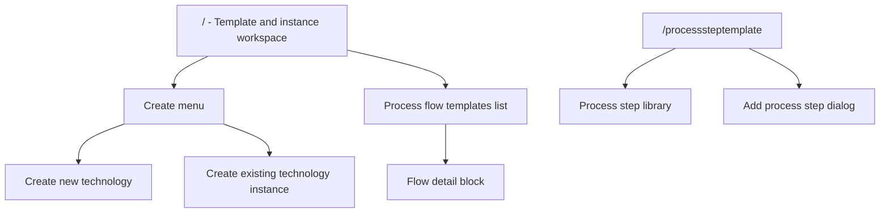

# Process Flow PoC V1 UI Product Specification

Last updated: 2026-05-18

此文件整理目前 `poc_v1` 前端已有的功能、互動與視覺樣式，目標是讓未來的我、其他工程師，或 V2 開發者能在沒有 Figma 設計稿的情況下，重新實作一個行為與感覺一致的 web app。

這份文件不是 domain model 的完整規格。Domain model 的正式語意仍以 `docs/development-document.md` 為主；本文件聚焦在 V1 UI 如何呈現與操作這些 model。

## 1. Product Intent

V1 是一個 browser-based proof of concept，用來建立與匯出 process flow template 和 process flow instance。

產品角色分成兩種：

- General user / simulation engineer：在首頁選擇既有 process flow template，建立 product-level process flow instance；或組合 process step templates 來建立新的 technology flow。
- Framework developer：在 `/processsteptemplate` 維護 reusable process step templates 與 field definitions。

V1 不包含：

- real backend persistence
- authentication / authorization
- real material DB、MES、PLM integration
- server-side validation
- geometry/FEM editor

所有 persisted data 以 seed data 加 browser `localStorage` 模擬。

## 2. Technology Baseline

Current implementation:

- Next.js app router
- React client components
- TypeScript
- Tailwind CSS
- `lucide-react` icons
- Browser `localStorage`
- JSON download export

重要路徑：

- `poc_v1/src/app/page.tsx`
- `poc_v1/src/app/processsteptemplate/page.tsx`
- `poc_v1/src/components/*`
- `poc_v1/src/domain/*`
- `poc_v1/src/data/seedCatalog.ts`

## 3. Routes

### 3.1 `/`

Main user workspace。

用途：

- 查看 process flow template list。
- 點擊 process flow template 後看 detail block。
- 透過 `Create` menu 建立新的 technology flow 或從既有 template 建立 instance。
- 匯出 instance 後顯示 last exported confirmation，並提供 export catalog。

首頁不應顯示 process step template library，也不應提供 process step template 新增/編輯入口。

### 3.2 `/processsteptemplate`

Framework developer page。

用途：

- 查看 process step template library。
- 新增 local process step template。
- 設定 field definitions。
- 建立 repeater field 與 repeat item child fields。

此 route 可直接輸入網址進入，也可從頁面內的 `Workspace` link 回首頁。

## 4. Information Architecture



## 5. Data Concepts Used By UI

### 5.1 Process Step Template

Reusable station definition。

Shown in:

- Step picker modal inside new technology flow builder.
- Process step library page.
- Flow blocks, resolved from flow template `stepRefs`.

UI fields:

- `name`
- `id`
- `version`
- `categoryId`
- `purpose`
- `owner`
- `status`
- `fieldDefinitions[]`

### 5.2 Field Definition

Defines how one parameter should be rendered and validated.

Supported V1 UI control types:

- `text`
- `number`
- `checkbox`
- `select`
- `referenceSelect`
- `repeater`

Computed fields remain part of the domain model, but V1 UI does not implement computed field creation or formula recomputation. If imported/seeded data contains `controlType: "computed"`, the UI may show it as read-only, but V1 does not calculate or update its value.

Supported V1 field definition value types:

- primitive: `string`, `integer`, `float`, `boolean`
- references: `material`, `layoutReference`, `geometryReference`
- primitive arrays: `string[]`, `integer[]`, `float[]`
- reference arrays: `material[]`, `layoutReference[]`, `geometryReference[]`
- repeat group: `fieldGroupArray`

`repeater` is represented as:

- parent `FieldDefinition.controlType = "repeater"`
- parent `FieldDefinition.valueType = "fieldGroupArray"`
- parent `repeatDefinition.itemFieldDefinitions[]`
- instance value `FieldGroupArrayValue.items[]`

### 5.3 Process Flow Template

Ordered technology flow. It references process step templates through `stepRefs[]`.

UI fields:

- `name`
- `description`
- `owner`
- `version`
- `status`
- `stepRefs[]`

Homepage list only displays `name`. Detailed metadata appears only after user clicks one flow.

### 5.4 Process Flow Instance

Product-level fill-in result created from a flow template.

UI fields:

- `productName`
- `processFlowTemplateId`
- `processFlowTemplateVersion`
- `stepValueSets[]`

## 6. Main Page UX

### 6.1 Header

Container:

- white panel
- 8px radius
- slate border
- soft shadow
- max width `max-w-7xl`
- responsive horizontal layout on large screens

Content:

- eyebrow: `Process Flow PoC V1`
- title: `Template and instance workspace`
- body copy: one short sentence about reusable process step templates and export.
- right side action: `Create` menu.

Do not add high-level stats cards for process step template count or process flow template count.

### 6.2 Create Menu

Button:

- label `Create`
- teal filled button
- chevron down icon

Dropdown:

- right aligned
- width capped at `min(360px, calc(100vw - 2rem))`
- white background
- slate border
- soft shadow
- first item: `Create new technology`
- following items: `Create {template.name}` for every available process flow template

Behavior:

- click outside closes menu
- selecting `Create new technology` opens flow builder mode
- selecting existing template opens instance editor mode

### 6.3 Process Flow Template List

The homepage list is intentionally minimal.

Each list row:

- button
- white background
- slate border
- min height around 64px
- displays only the process flow template name
- selected row uses teal border and pale teal background

No steps are shown inline in the homepage list.

Clicking a row:

- marks it selected
- opens a flow detail block as a modal overlay

### 6.4 Flow Detail Block

Modal overlay:

- fixed full-screen overlay
- dark translucent slate backdrop
- top aligned with page padding
- max width around `max-w-6xl`
- max height `calc(100vh - 6rem)`
- white panel with 8px radius, border, soft shadow

Header:

- eyebrow `Process flow detail`
- flow name
- description
- close icon button

Metadata section:

- 3 compact panels in a responsive grid
- owner
- version
- status

Flow steps section:

- grey-tinted band (`bg-slate-50`)
- label `Flow steps`
- uses `StepFlowBlocks`
- step blocks are arranged horizontally
- arrows between step blocks indicate continuous flow
- horizontal scroll if the flow is wider than viewport

## 7. Creating A New Technology Flow

Entry:

- `Create` menu -> `Create new technology`

Top section:

- panel title `Build a process flow`
- close icon button returns to dashboard
- inputs:
  - `Technology name`
  - `Product / instance name`

Add step:

- UI initially shows only an `Add step` button.
- Clicking `Add step` opens a process step picker modal.
- The step picker lists reusable process step templates as compact cards.
- Cards show:
  - step template name
  - id/version
  - purpose
  - `repeater` badge when any field definition uses `controlType: "repeater"`
- Selecting a card appends that step to the end of the flow and closes the picker.

Flow editing:

- Added steps appear as large horizontal blocks.
- Blocks are connected by right arrow icons.
- Clicking a block selects it.
- Only the selected block's parameters are shown in the `Step settings` panel.
- Each block can be removed with a trash icon.
- If the selected step is removed, selection falls back to the last remaining step.

Validation:

- technology name is required
- product/instance name is required
- at least one process step is required
- required field values must be filled unless marked unknown
- number fields must be valid numbers and respect min/max validation
- repeater fields validate min/max item count and child fields recursively

Footer actions:

- `Export only`
  - saves instance locally
  - downloads instance JSON
  - does not add the flow template to local catalog
- `Save template & export`
  - saves draft flow template to local catalog
  - saves instance locally
  - downloads JSON with referenced process step templates, flow template, and instance

## 8. Creating An Instance From Existing Technology

Entry:

- `Create` menu -> `Create {template.name}`

Top section:

- eyebrow `Create existing technology`
- selected flow template name
- body copy references template version
- close icon button returns to dashboard

User input:

- `Product / instance name`

Flow interaction:

- Existing template steps render as horizontal step blocks.
- User clicks a step block to edit that step's parameters.
- Parameters are shown only for selected step.
- Existing template editor does not allow adding/removing steps.

Footer action:

- `Export instance`
  - validates input
  - saves instance locally
  - downloads instance JSON
  - returns to dashboard

## 9. Process Step Template Page

Route:

- `/processsteptemplate`

Header:

- top link `Workspace` with left arrow
- eyebrow `Framework developer`
- title `Process step templates`
- body copy describes reusable station definitions
- primary action `Add process step`

Main content:

- process step library list

## 10. Process Step Library

Each process step template item shows:

- template name
- id/version
- field count badge
- field details

Each field detail shows:

- label
- control type
- value type
- unit, if present
- required badge, if required

For repeater fields:

- also show child fields from `repeatDefinition.itemFieldDefinitions[]`
- child field chip format: `{child label} / {child control type}`

## 11. Add Process Step Dialog

Entry:

- `/processsteptemplate` -> `Add process step`

Modal:

- centered overlay
- dark translucent backdrop
- max width around `max-w-5xl`
- max height bound to viewport
- internal scroll for form body

Fields:

- `Step template name`
- `Category ID`
- repeated list of field definitions

Field editor row:

- `Label`
- `Field id`
- `Description`
- `Scope`
- `Value type`
- compatible `Control`
- `Selection` when applicable
- `Unit`
- `Required`
- `Review`
- remove button

Conditional field definition sections:

- numeric validation: `min`, `max`, `exclusiveMin`, `exclusiveMax`
- string validation: `minLength`, `maxLength`, `regex`
- primitive option source for `select` and option-style `checkbox`
- reference source and mock options for `referenceSelect`
- repeat definition for `repeater`

The UI only shows compatible control types for the selected `valueType`. Reference value types use `referenceSelect`; array value types use `selectionMode: "multiple"`; and `fieldGroupArray` uses `repeater`.

Repeater behavior:

- Selecting `Repeater` expands a nested `Repeat item fields` editor.
- Default child fields:
  - `Material`
  - `Thickness`
- Framework developer can add/remove child fields.
- Child field types exclude nested repeater in the current UI; V1 supports one repeater level only.
- Saved repeater field includes:
  - `repeatDefinition.itemLabelTemplate`
  - `repeatDefinition.indexBase = 1`
  - `repeatDefinition.minItems = 1` if required, else `0`
  - `repeatDefinition.maxItems = 12`
  - `repeatDefinition.itemFieldDefinitions[]`

Validation:

- step template name is required
- `categoryId` is required
- top-level field ids must be unique
- repeater child field ids must be unique within that repeater
- repeater must have at least one child field
- option and reference mock options must have required values and labels

Save behavior:

- creates draft process step template
- version defaults to `1.0.0`
- owner defaults to `simulation-team`
- status defaults to `draft`
- persists to `localStorage` as catalog addition
- closes modal and refreshes library

## 12. Parameter Field Rendering

All parameter fields share the same base visual style:

- white row/card
- slate border
- 6px radius
- label and description on left
- input control on right
- optional unit chip
- `Unknown` checkbox

Supported rendering:

- `number`
  - numeric input
  - empty input maps to `null`
  - finite number maps to number value
- `checkbox` or boolean value type
  - boolean checkbox for `valueType: "boolean"`
  - option checkbox group for primitive option fields
- `select`
  - single select for `selectionMode: "single"`
  - compact checkbox list for `selectionMode: "multiple"`
- `referenceSelect`
  - single select for `selectionMode: "single"`
  - compact checkbox list for `selectionMode: "multiple"`
  - selected value stores `ReferenceValue` or `ReferenceValue[]`
- `computed`
  - V1 does not implement computed formula execution
  - imported/seeded computed values may be displayed as disabled/read-only text
- default
  - text input

Unknown behavior:

- setting unknown marks `unknown = true`
- value becomes `null`
- validation skips required value for unknown fields

## 13. Repeater Parameter Rendering

Repeater parameter is a parent field card.

Header:

- field label
- description
- item count chip
- `Item` add button
- `Unknown` checkbox

Item behavior:

- minimum item count follows `repeatDefinition.minItems`
- maximum item count follows `repeatDefinition.maxItems`
- adding an item creates a stable `itemId`
- item index starts at `repeatDefinition.indexBase`, default `1`
- removing disabled when item count is at minItems

Item UI:

- each repeat item appears as nested slate panel
- header uses `repeatDefinition.itemLabelTemplate`, replacing `{{index}}`
- child fields render recursively with `ParameterField`

Export value shape:

```json
{
  "fieldId": "rdl_layers",
  "value": {
    "items": [
      {
        "itemId": "rdl_layers_1_xxxxxx",
        "index": 1,
        "fieldValues": []
      }
    ]
  },
  "unknown": false
}
```

## 14. Step Flow Blocks

Used in:

- flow detail modal
- new technology builder
- existing technology instance editor

Visual:

- horizontal row
- each block `w-72`, `min-h-36`
- white background
- slate border
- 8px radius
- selected block uses teal border and teal focus shadow
- step number is displayed in a dark or teal square
- right arrow icon between blocks
- horizontal scrolling enabled

Block content:

- step order number
- step template name
- step ref id
- field count
- optional remove icon if editing a draft flow

Behavior:

- clicking a block selects it
- selected block determines which parameter settings panel is displayed
- in read-only detail context, selection is visually fixed on the first block and clicking does not change detail content

## 15. Visual Design System

Overall feeling:

- internal engineering tool
- dense but not cramped
- restrained, technical, readable
- no marketing hero page
- no decorative illustration
- no heavy gradients beyond body background

Layout:

- page padding: `px-4 py-5`, larger horizontal padding at `sm` and `lg`
- main content max width: `max-w-7xl`
- page sections separated by `gap-5`
- panels use full width bands/cards with clear borders

Colors:

- page background: `#f7f8fb` with subtle white-to-slate vertical gradient
- primary text: slate 950 / custom body `#172033`
- secondary text: slate 500/600
- primary action: teal 700, hover teal 800
- selected states: teal border, teal 50 background
- warnings/errors: rose/amber palettes
- neutral panels: white, slate 50, slate 100, slate 200 borders
- special repeater badge: cyan 50 / cyan 700

Typography:

- default browser/system font through Tailwind
- no negative letter spacing
- headers use semibold
- small uppercase eyebrow labels use tracking-wide
- compact operational text uses `text-xs` and `text-sm`
- page title uses `text-2xl`
- section title uses `text-base` or `text-lg`

Shape:

- most containers use `rounded-lg` or `rounded-md`
- avoid overly pill-shaped controls except small status badges
- cards and blocks use 6px to 8px radius

Borders and shadows:

- borders are mostly `border-slate-200`
- important selected state uses `border-teal-600`
- app-specific shadow token: `shadow-soft = 0 18px 50px -28px rgb(15 23 42 / 0.35)`

Icons:

- use `lucide-react`
- icon buttons are square, usually `h-9 w-9`
- common icons:
  - `Create`: chevron
  - new technology: flask
  - flow template: workflow
  - process step library: layers
  - close: X
  - add: plus
  - remove: trash
  - export: download/database/file json

Responsive behavior:

- forms stack on mobile and become grids on wider screens
- flow blocks remain horizontal with scroll instead of compressing
- modals use viewport-based max height and internal scrolling
- dropdown width respects viewport

## 16. Persistence And Export

Local storage keys:

- `process-flow.catalog.v1`
- `process-flow.instances.v1`

Catalog load behavior:

- seed catalog is always loaded
- local additions merge by `{id}@{version}`
- local additions can override seed entries with same key

Export behavior:

- JSON download through Blob and temporary anchor
- instance export file name: `{instance.id}.json`
- template plus instance export file name: `{flowTemplate.id}_with_{instance.id}.json`
- catalog export file name: `process-flow-catalog-v1.json`
- schema version: `process-flow-v1`

## 17. Current Seed Catalog Expectations

Seed process step templates include:

- Initial wafer
- Add layer1
- Add layer12
- RDL build-up
- Grind
- Flip

Seed process flow templates include:

- Demo Single Layer Technology
- Demo Dual Material Technology
- Demo Flip Technology
- Demo Hybrid Stack Technology
- Demo RDL Repeat Technology

The RDL flow is the baseline demonstration for repeater behavior.

## 18. V2 Extension Guidance

Use this document as a baseline contract before adding V2 features.

Recommended V2 process:

1. Add new feature requirements as user workflows, not just component tasks.
2. Extend the route map and component inventory in this document.
3. Add any new domain concepts to the data model section.
4. Define visual and interaction rules before implementing.
5. Keep screenshots or Playwright captures as optional references, but do not rely on screenshots as the only spec.

Better alternatives to Figma for this project:

- Keep this Markdown UI specification as the source of truth for product behavior.
- Add a lightweight component catalog page inside the app if reusable UI grows.
- Add Playwright visual snapshots for important states once the UI stabilizes.
- Use Mermaid diagrams in docs for workflows and data relationships.
- Only introduce Figma if pixel-perfect collaboration with designers becomes necessary.

## 19. Implementation Checklist For Rebuilding

A compatible implementation should satisfy:

- `/` route exists and loads process flow templates from seed plus local additions.
- Homepage list only shows process flow names.
- Clicking a flow opens a detail block with owner, description, version, status, and horizontal step flow.
- `Create` menu supports new technology and existing template instance creation.
- New technology builder supports add-step picker modal.
- Draft flow steps render as large horizontal blocks with arrows.
- Step parameter settings show only for selected step.
- Existing template instance editor uses the same step block interaction without add/remove step.
- `/processsteptemplate` route supports process step template library and add dialog.
- Add process step dialog supports Repeater field creation.
- Add process step dialog supports full field definition settings except computed formula creation.
- Parameter renderer supports repeater items and recursive child fields.
- Validation covers required fields, numbers, primitive options, reference values, and repeater children.
- Export produces V1 JSON payloads with schema version `process-flow-v1`.
- Visual style remains light, slate/teal, compact, internal-tool oriented.
