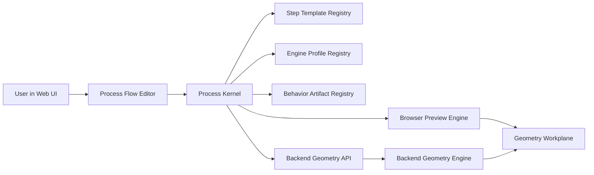

# Process Flow V2 Geometry Workplane Technical Design

## 1. 文件目的

本文件定義 V2 Geometry Workplane 的技術方向。V1 已建立 ProcessStepTemplate、ProcessFlowTemplate、ProcessFlowInstance 與 FieldDefinition 等 process-state 資料模型；V2 在此基礎上增加 geometry engine、behavior plugin、engine profile 與 geometry state 等能力。

本文件不覆蓋 V1 文件，而是描述 V1 資料結構如何擴充，讓 process flow 可以驅動 preview geometry、backend geometry generation 與未來 FEM preprocessing。

## 2. Concept

### 2.1 Kernel 與 process behavior 分離

V2 的核心原則是：kernel 不實作個別 process step 的幾何邏輯。

Kernel 負責：

- resolve process flow template、step refs 與 process step template versions。
- validate instance values。
- 根據使用者選擇的 engine profile 找出每個 step 的 behavior binding。
- 依照 flow 順序呼叫 behavior implementation。
- 管理 GeometryState、GeometryPatch、diagnostics、cache 與 provenance。

Process step behavior 負責：

- 讀取該 step 的 field values 與上游 geometry state。
- 依照 process 行為產生 geometry patch。
- 回傳 warnings、diagnostics 與 generated feature metadata。

因此 kernel 不需要知道 molding、underfill、die attach 的細節。新增 process step 時，開發者只需新增 step template 與對應 behavior implementation。

### 2.2 多種 geometry engine profile

同一個 process step 可以支援多個 engine profile。每個 engine profile 代表一種執行位置、精度與輸出用途。

範例 engine profiles：

| Engine profile | 執行位置 | Runtime | 用途 |
| --- | --- | --- | --- |
| `preview-2d-web` | Browser | WASM | 預設快速 preview，顯示主要結構輪廓。 |
| `standard-3d-backend` | Backend server | Python/C++/container | 產生較完整 2.5D 或 simplified 3D geometry。 |
| `complex-3d-backend` | Backend server | C++/container/service | 產生高精度 geometry，包含更細節的封裝結構。 |
| `fem-prep-backend` | Backend server | container/service | 產生 FEM preprocessing output 或 solver input。 |

Published process step template 建議至少支援 `preview-2d-web`，讓使用者在 Web 上有一致的預設體驗。Draft step template 可允許暫時缺少 preview binding，並由 UI 使用 placeholder 或 warning 表示。

### 2.3 Preview 與 backend 的角色分工

Preview engine 的目標是快速溝通結構概念，不追求完整製程模擬。它應能顯示 die、substrate layers、underfill、molding、interposer 等主要幾何特徵。

Backend engine 的目標是產生 canonical result，供正式 geometry export、FEM preprocessing 或後續 simulation 使用。若 preview 與 backend 結果不同，正式流程以 backend geometry result 為準。

### 2.4 系統架構



### 2.5 主要資料流

1. 使用者在 Web UI 選擇 process flow template 並建立或開啟 process flow instance。
2. Kernel resolve instance 綁定的 flow template version。
3. Kernel 依據 flow template 的 `stepRefs[]` resolve 每個 ProcessStepTemplate version。
4. UI 顯示目前 flow 可選擇的 engine profiles。
5. 使用者使用 default preview engine 時，browser 下載或載入對應 WASM behavior artifacts。
6. Preview engine 依照 process step 順序執行 behavior，逐步產生 GeometryState 或 GeometryScene。
7. 使用者選擇 backend engine 時，Web UI 送出 backend geometry request。
8. Backend geometry service resolve 同一組 template、values、behavior artifact 與 engine profile。
9. Backend 執行 geometry generation，回傳 output geometry、diagnostics 與 provenance。
10. Web UI 取得 backend result，顯示於 workplane 或供後續 FEM workflow 使用。

## 3. Data Structure Extensions

V2 不替換 V1 資料模型，而是在現有資料模型上新增 geometry-related structures。

### 3.1 ProcessFlowExport extension

V2 export root 可新增以下 top-level collections：

| 欄位 | 型別 | 說明 |
| --- | --- | --- |
| `geometryEngineProfiles` | `GeometryEngineProfile[]` | 系統可用的 geometry engine profiles。 |
| `geometryBehaviorArtifacts` | `GeometryBehaviorArtifact[]` | 可執行 behavior artifacts 的 registry snapshot。 |

### 3.2 GeometryEngineProfile

`GeometryEngineProfile` 描述使用者可選擇的 geometry engine 類型。UI 可根據此資料顯示 Preview、Standard、Complex 或 FEM Prep 等選項。

必要欄位：

| 欄位 | 型別 | 說明 |
| --- | --- | --- |
| `id` | `string` | engine profile ID，例如 `preview-2d-web`。 |
| `name` | `string` | UI 顯示名稱。 |
| `description` | `string` | engine 用途說明。 |
| `fidelity` | `EngineFidelity` | `preview`、`standard`、`complex` 或 `femPrep`。 |
| `executionLocation` | `ExecutionLocation` | `web` 或 `backend`。 |
| `runtimeType` | `RuntimeType` | `wasm`、`container`、`python`、`cppService`、`remoteService` 等。 |
| `outputKind` | `GeometryOutputKind` | `geometryScene`、`geometryState`、`cadArtifact`、`femInput`。 |
| `default` | `boolean` | 是否為預設 engine。通常 `preview-2d-web` 為 true。 |
| `status` | `TemplateStatus` | `draft`、`published` 或 `deprecated`。 |

範例：

```json
{
  "id": "preview-2d-web",
  "name": "Preview 2D Web",
  "description": "Fast browser-side package structure preview.",
  "fidelity": "preview",
  "executionLocation": "web",
  "runtimeType": "wasm",
  "outputKind": "geometryScene",
  "default": true,
  "status": "published"
}
```

### 3.3 ProcessStepTemplate extension

V2 在 `ProcessStepTemplate` 新增 `geometryBehaviorBindings`。

| 欄位 | 型別 | 說明 |
| --- | --- | --- |
| `geometryBehaviorBindings` | `GeometryBehaviorBinding[]` | 此 step template 在不同 engine profile 下的 geometry behavior implementation。 |

範例：

```json
{
  "id": "step_tpl_molding_encapsulation",
  "version": "1.0.0",
  "name": "Molding / Encapsulation",
  "geometryBehaviorBindings": [
    {
      "bindingId": "molding-preview-2d-web",
      "engineProfileId": "preview-2d-web",
      "behaviorId": "molding.encapsulation.preview",
      "behaviorVersion": "1.0.0",
      "contractVersion": "geometry-step-v1",
      "requiredForPublishedStep": true
    },
    {
      "bindingId": "molding-standard-3d-backend",
      "engineProfileId": "standard-3d-backend",
      "behaviorId": "molding.encapsulation.standard3d",
      "behaviorVersion": "1.0.0",
      "contractVersion": "geometry-step-v1",
      "requiredForPublishedStep": false
    }
  ]
}
```

### 3.4 GeometryBehaviorBinding

`GeometryBehaviorBinding` 是 step template 與 behavior artifact 之間的連結。它不保存大量 source code，只保存可解析到 immutable artifact 的 metadata。

必要欄位：

| 欄位 | 型別 | 說明 |
| --- | --- | --- |
| `bindingId` | `string` | binding ID，在同一 step template version 內唯一。 |
| `engineProfileId` | `string` | 指向 `GeometryEngineProfile.id`。 |
| `behaviorId` | `string` | 指向 `GeometryBehaviorArtifact.behaviorId`。 |
| `behaviorVersion` | `semver string` | 指向特定 behavior artifact version。 |
| `contractVersion` | `string` | behavior input/output contract version。 |
| `requiredForPublishedStep` | `boolean` | published step 是否必須具備此類 binding。 |
| `inputMapping` | `GeometryInputMapping[]` | Optional，用來說明 field values 如何對應到 geometry behavior inputs。 |
| `capabilities` | `string[]` | Optional，例如 `adds-solid-region`、`updates-layer-stack`。 |

### 3.5 GeometryBehaviorArtifact

`GeometryBehaviorArtifact` 描述可執行的 plugin artifact。Artifact 可能是 WASM file、container image、Python package、C++ service package 或 remote service endpoint。

必要欄位：

| 欄位 | 型別 | 說明 |
| --- | --- | --- |
| `behaviorId` | `string` | behavior ID，例如 `molding.encapsulation.preview`。 |
| `version` | `semver string` | behavior artifact version。 |
| `runtimeType` | `RuntimeType` | `wasm`、`container`、`python`、`cppService`、`remoteService`。 |
| `artifactUri` | `string` | artifact registry 或 object storage URI。 |
| `artifactDigest` | `string` | immutable digest，例如 `sha256:...`。 |
| `entrypoint` | `string` | runtime 呼叫入口，例如 `apply`。 |
| `sourceRepoUrl` | `string` | source code repository。 |
| `sourceCommit` | `string` | source code commit SHA。 |
| `compatibleKernel` | `string` | kernel semver range。 |
| `status` | `TemplateStatus` | `draft`、`published` 或 `deprecated`。 |

DB 應保存 artifact metadata 與版本，不應保存大量 source code。Source code 應存在 GitLab 或其他 source repository；artifact 應由 CI build/test 後發布到 artifact registry。

### 3.5.1 Why GeometryBehaviorArtifact uses reference

`GeometryBehaviorBinding` 使用 `behaviorId` + `behaviorVersion` 指向 `GeometryBehaviorArtifact`，而不是直接把完整 artifact metadata 嵌入 `ProcessStepTemplate`，主要是為了讓可執行程式可以被重用、獨立治理與集中驗證。

雖然從 process step owner 的管理角度，behavior artifact 通常會跟特定 process step 一起被檢視與維護；但在資料模型上，建議把「step 使用哪個 behavior」與「behavior artifact 本身如何被部署與驗證」分開。

建議責任分工如下：

```text
ProcessStepTemplate
  - owns process semantics
  - owns fieldDefinitions
  - owns geometryBehaviorBindings

GeometryBehaviorBinding
  - says which engine profile this step supports
  - maps step fields to behavior inputs
  - references behavior artifact by behaviorId + behaviorVersion

GeometryBehaviorArtifact
  - owns executable artifact metadata
  - owns artifactUri, artifactDigest, runtimeType, entrypoint
  - owns sourceCommit, compatibility, security and release metadata
```

使用 reference 的主要理由：

- Reuse：多個 process steps 可能使用同一個 generic behavior program。例如 `generic.add-layer.preview`、`generic.place-rectangle.preview`、`generic.fill-region.preview` 可被 substrate layer、die placement、molding envelope 等不同 step template 重用，只靠不同 `inputMapping` 區分行為。
- Avoid duplication：如果 artifact metadata 直接嵌入每個 step template，同一個 executable artifact 的 `artifactUri`、`digest`、`sourceCommit`、runtime metadata 會重複多份，後續更新與審核容易不一致。
- Independent versioning：若只修 geometry program 的 bug，可以只發布新的 `GeometryBehaviorArtifact` version；不一定要升 `ProcessStepTemplate` version。只有當 process semantics、fieldDefinitions 或 input mapping 改變時，才需要升 step template version。
- Runtime resolution：kernel 執行時需要用 `behaviorId` + `behaviorVersion` resolve artifact，驗證 `artifactDigest`、contract version 與 kernel compatibility。集中 registry 比散落在每個 step template 的 embedded metadata 更容易控制。
- Security and governance：artifact 的安全掃描、簽章、dependency metadata、deprecation status 與 approval record 屬於 executable release governance，適合集中放在 artifact registry。
- Export flexibility：正式 DB 可使用 normalized reference；JSON export 或 review package 則可以額外包含 `artifactSnapshot`，方便離線審查與可攜帶交換。

因此建議採用 hybrid model：

```json
{
  "geometryBehaviorBindings": [
    {
      "bindingId": "molding-preview-2d-web",
      "engineProfileId": "preview-2d-web",
      "artifactRef": {
        "behaviorId": "molding.encapsulation.preview",
        "behaviorVersion": "1.0.0"
      },
      "contractVersion": "geometry-step-v1",
      "inputMapping": [],
      "artifactSnapshot": {
        "runtimeType": "wasm",
        "artifactUri": "registry.example.com/process/molding-preview:1.0.0",
        "artifactDigest": "sha256:...",
        "sourceCommit": "abc123"
      }
    }
  ]
}
```

在 UI 上，ProcessStepTemplate detail page 應把 referenced artifact resolve 後顯示在同一個管理區塊，讓 step owner 感覺它們是一起管理的；但在 DB 與 runtime contract 中，artifact 仍應以 reference 方式連結。

### 3.6 GeometryState、GeometryPatch、GeometryScene

`GeometryState`、`GeometryPatch`、`GeometryScene` 是 geometry engine 與每個 process step behavior 之間最重要的共同介面。它們的目的不是描述某一個特定製程，而是定義所有 geometry implementation 都要遵守的資料邊界。

這三個介面分別負責不同層次：

- `GeometryState`：engine 內部逐步累積的 canonical geometry working state。每個 process step behavior 會讀取目前 state，但不應直接修改它。
- `GeometryPatch`：單一 process step behavior 對 geometry state 提出的變更。Kernel 或 engine runtime 會驗證 patch，再把 patch 套用到 state。
- `GeometryScene`：給 Web workplane render 的輕量化顯示資料。它可以來自 preview engine，也可以由 backend result 轉換而來，但不應作為正式 geometry source of truth。

這樣分層的主要用意是讓每個 step behavior 保持局部、可測試、可追溯。Process step 不需要知道整條 flow 如何執行，也不需要直接管理 global geometry object；它只需要根據自己的 input state、process parameters 與 upstream geometry state，回傳一個清楚的 geometry patch。

建議概念：

```text
GeometryState
  - features[]
  - materials[]
  - coordinateSystem
  - units
  - provenance

GeometryPatch
  - addFeatures[]
  - updateFeatures[]
  - removeFeatureIds[]
  - diagnostics[]

GeometryScene
  - viewMode
  - layers[]
  - shapes[]
  - labels[]
  - featureRefs[]
```

Backend complex engine 可輸出 CAD artifact 或 FEM input；Web UI 不一定直接讀完整 CAD，而是讀 backend 同步產生的 lightweight `GeometryScene` preview。

Geometry interface design guideline：

- Treat GeometryState as immutable input：process step behavior 不應直接 mutate upstream `GeometryState`，而是回傳 `GeometryPatch`。
- Patch should be step-local：一個 step behavior 只描述該 step 造成的新增、修改或移除，不應重建整個 package geometry。
- Use stable feature identity：新增的 geometry feature 應有穩定 ID，並記錄來源 `stepRefId`、process step template version 與相關 `fieldId`，讓 UI 可反查 geometry feature 來自哪個製程步驟與參數。
- Keep units explicit：所有 length、position、thickness、angle、material property 都必須使用 canonical unit 或清楚標示 unit conversion，不依賴隱含單位。
- Separate semantic geometry from rendering：`GeometryState` / `GeometryPatch` 描述幾何語意；`GeometryScene` 描述如何顯示。不要把顏色、label placement、camera setting 等 render-only 資訊寫回 canonical geometry state。
- Allow fidelity-specific detail：preview engine 可以只產生 envelope、layer block 或 simplified shape；backend engine 可以產生更細節的 3D feature、CAD artifact 或 FEM input。但兩者應共用相同 process parameter definition。
- Preserve diagnostics：當資料不足、假設過多、單位不明或 geometry 無法生成時，behavior 應回傳 diagnostics，而不是 silently 產生看似正確的 geometry。
- Prefer composable features：layer、die、underfill、molding、substrate block、keep-out region 等應盡量以可組合 feature 表達，避免產生後續 step 無法理解的 opaque blob。

### 3.7 Engine availability

UI 顯示某條 flow 可用 engines 時，應由系統計算 support matrix：

```text
For each GeometryEngineProfile:
  For each enabled StepRef:
    resolve ProcessStepTemplate version
    check whether geometryBehaviorBindings contains that engineProfileId

  If every enabled step has binding:
    engine available
  If any enabled step is missing binding:
    engine unavailable, with missing step list
```

Draft workflow may still show placeholder geometry for missing preview bindings, but that is a UI fallback behavior, not a `ProcessFlowTemplate` data field. Published flow execution should treat an engine as available only when all enabled steps support that engine profile.

## 4. Behavior Contract

Behavior contract 是每個 process step geometry implementation 都必須遵守的執行介面。它定義 kernel / engine runtime 如何呼叫一個 step behavior，以及 behavior 必須回傳什麼結果。

不同 engine profile 可以使用不同 runtime，例如 Web preview 使用 WASM、backend standard engine 使用 Python/C++/container。但不論 runtime 是什麼，behavior 的 input/output 語意都應保持一致。這能讓同一個 process step 在不同 fidelity engine 中維持相同資料來源、相同欄位語意與相同 provenance model。

Conceptually，每個 step behavior 都應接近以下形狀：

```text
apply(BehaviorInput) -> BehaviorOutput
```

Behavior 不負責決定 flow 順序、不負責查詢下一個 step、不負責修改 process instance，也不負責執行 review workflow。這些都由 kernel 或 application layer 管理。Behavior 只負責一件事：根據目前 process step 的資料與 upstream geometry state，產生 geometry patch、scene patch 與 diagnostics。

### 4.1 Input

Behavior input 建議包含以下欄位：

| 欄位 | 說明 |
| --- | --- |
| `contractVersion` | Behavior contract version，用於 runtime 驗證 input/output schema 是否相容。 |
| `engineProfileId` | 目前執行的 engine profile，例如 `preview-2d-web` 或 `standard-3d-backend`。 |
| `stepContext` | 此 step 在 flow 中的上下文，例如 step order、stepRefId、display name、enabled state。 |
| `processStepTemplateId` | process step template ID。 |
| `processStepTemplateVersion` | process step template version。 |
| `stepRefId` | 此 step 在目前 flow template 中的穩定 reference ID。 |
| `fieldValues` | 此 step 的 instance values，包含 input state、output state 與 process parameters。 |
| `upstreamGeometryState` | 此 step 執行前已累積出的 geometry state。 |
| `unitSystem` | 本次 execution 使用的 canonical unit system。 |
| `referenceResolvers` | 受控 reference resolver，例如 material、layout 或 external geometry reference。 |
| `executionOptions` | engine-specific options，例如 preview detail level、tolerance、debug flag。 |

Input design guideline：

- Behavior 應只依賴 input payload，不應自行讀取 process instance DB 或全域 application state。
- Behavior 可讀取 upstream geometry state，但不應假設下游 steps 存在。
- `fieldValues` 應已經通過基本 schema validation；behavior 可做 geometry-specific validation。
- 外部 reference 應透過 `referenceResolvers` 取得，避免 behavior 自行呼叫任意 network 或 private API。
- 若 required geometry input 不足，behavior 應回傳 diagnostic，而不是猜測未提供的值。

### 4.2 Output

Behavior output 建議包含以下欄位：

| 欄位 | 說明 |
| --- | --- |
| `geometryPatch` | 此 step 對 canonical geometry state 提出的變更。 |
| `geometryScenePatch` | Optional，若 engine 直接產生 render scene，可回傳給 Web workplane 使用。 |
| `diagnostics` | warnings、errors、missing data、unsupported condition 等訊息。 |
| `generatedFeatureRefs` | 此 step 產生或修改的 geometry feature IDs。 |
| `provenance` | 此 output 使用的 step version、behavior artifact version、field values hash、engine profile 等追溯資訊。 |

Output design guideline：

- Behavior 應優先回傳 patch，而不是完整 geometry snapshot。
- 每個新增或修改的 feature 都應能追溯到 source step 與 source fields。
- Diagnostic 應可被 UI 顯示給使用者，例如 missing thickness、unsupported material、geometry overlap、unit mismatch。
- Preview behavior 可以回傳 simplified `geometryScenePatch`，但若有 canonical `geometryPatch`，仍應保持兩者 feature reference 可對應。
- Error 不應只以 exception 表達；可預期的資料不足或製程不支援情境應進入 `diagnostics`。

### 4.3 Behavior constraints

Behavior implementation 應符合以下規則：

- Deterministic：同一 input snapshot 與同一 artifact version 應產生相同 output。
- No hidden global state：不得依賴不可追溯的外部狀態。
- Unit explicit：所有數值必須使用 canonical unit 或明確 unit conversion。
- Schema validated：input/output 必須符合 contract schema。
- Side-effect controlled：Web WASM plugin 不應任意呼叫 network；backend plugin 應在 sandbox 或 controlled backend environment 中執行。

### 4.4 Process step behavior design guideline

開發每個 process step geometry behavior 時，建議遵守以下設計準則：

- Keep behavior focused：一個 behavior 只處理一個 process step 的幾何效果。例如 molding behavior 不應順便修正 die attach geometry，除非該 process step 的語意明確包含此變更。
- Match process semantics：geometry 行為必須對應 `ProcessStepTemplate` 的目的與欄位語意。若需要新增必要參數，應先更新 step template，而不是在 behavior 中使用 hidden parameter。
- Support graceful degradation：preview behavior 可以用 simplified geometry 表示複雜結構，但必須清楚保留 feature type 與 provenance，讓使用者知道這是簡化結果。
- Do not encode UI assumptions：behavior 不應依賴特定畫面大小、顏色、排序或互動方式。這些屬於 `GeometryScene` render layer 或 UI layer。
- Prefer shared primitives：若多個 steps 都需要 add layer、place block、fill region 等常見操作，應優先使用 shared geometry primitives 或 generic behavior，減少重複實作。
- Validate geometry-specific constraints：例如 thickness 不可為負、feature 不應無意義重疊、material reference 不符合此 step 用途時應產生 warning 或 error。
- Make output reviewable：產生的 feature ID、feature type、source step、source fields 與 diagnostics 應足夠清楚，讓 simulation engineer 與 integration reviewer 能理解 geometry 從哪裡來。
- Keep preview and backend aligned：preview 與 backend 可以有不同細節程度，但不應使用不同欄位語意或不同單位假設。

## 5. Execution Model

### 5.1 Web preview execution

Web preview 用於 default geometry workplane。

流程：

1. UI 讀取 instance 與 flow template。
2. Kernel 或 frontend domain layer resolve enabled steps。
3. UI 確認所有 step 支援 `preview-2d-web`，或在 draft workflow 中使用 placeholder fallback。
4. Browser 載入 WASM behavior artifact。
5. 每個 step 依序執行 `apply()`。
6. Preview engine 累積 GeometryScene。
7. Workplane render 結果並顯示 diagnostics。

### 5.2 Backend geometry execution

Backend execution 用於 standard、complex 或 FEM prep。

流程：

1. UI 送出 backend geometry request，包含 instance ID、engine profile 與必要 execution options。
2. Backend resolve flow、step templates、engine profile、behavior artifacts。
3. Backend 驗證 artifact digest、contract version 與 kernel compatibility。
4. Engine 依序執行 step behaviors。
5. Backend 回傳 geometry result、diagnostics 與 provenance。
6. UI 載入 backend result，更新 workplane 顯示。

## 6. Developer 開發流程

### 6.1 新增 process step template

開發者新增 process step 時，先定義 process 語意與欄位：

1. 定義 `ProcessStepTemplate.id`、`version`、`name`、`purpose`、`owner`。
2. 定義 `fieldDefinitions[]`，包含 input state、output state 與 process parameter。
3. 定義每個 field 的 value type、unit、validation、review requirement。
4. 若欄位會影響 geometry，補上 `inputMapping` 或 geometry semantic metadata。

### 6.2 新增 preview behavior

Published step template 建議至少提供 Web preview behavior。

流程：

1. 選擇 target engine profile，例如 `preview-2d-web`。
2. 使用 WASM-compatible 技術實作 behavior，例如 Rust、C++ 或 AssemblyScript。
3. 實作 `apply(stepContext, geometryState, parameters)`。
4. 輸出 `GeometryPatch` 或 `GeometryScenePatch`。
5. 使用 fixture 測試典型 input / output。
6. CI build WASM artifact。
7. CI 計算 artifact digest 並發布到 artifact registry。
8. DB registry 新增 `GeometryBehaviorArtifact`。
9. ProcessStepTemplate 新增 `GeometryBehaviorBinding`。

### 6.3 新增 backend behavior

若需要 standard、complex 或 FEM prep，開發者可新增 backend implementation。

流程：

1. 選擇 target engine profile，例如 `standard-3d-backend`。
2. 使用 Python、C++、container 或 remote service 實作。
3. 遵守同一份 behavior contract。
4. CI 執行 unit test、golden geometry test 與 schema validation。
5. 發布 immutable artifact。
6. 更新 `GeometryBehaviorArtifact` 與 `GeometryBehaviorBinding`。

### 6.4 是否一定要寫兩套程式

不一定。可依 step 複雜度選擇：

- Simple step：使用 declarative geometry rule，不寫自訂程式。
- Typical step：提供 WASM preview，backend implementation optional。
- Complex step：preview 只畫 envelope 或 simplified shape，backend 才產生詳細 geometry。
- Shared core：若核心邏輯用 Rust/C++，可同時 compile 成 WASM 與 server artifact，降低雙實作漂移。

### 6.5 Publish criteria

建議 publish rules：

- Draft step template 可缺少 behavior binding。
- Published step template 至少需要 `preview-2d-web` binding，或明確設定 generic placeholder fallback。
- Published behavior artifact 必須有 immutable version、digest、source commit、contract version 與 compatibility range。
- 不允許 published binding 指向 mutable branch、`latest` tag 或未固定 digest 的 artifact。

## 7. 使用者使用方式

### 7.1 編輯與 preview

使用者流程：

1. 在 Web UI 選擇 process flow template。
2. 建立或開啟 TV/Product instance。
3. 填寫每個 process step 的 values、source、assumption 與 unknown。
4. Geometry Workplane 使用 default preview engine 自動更新。
5. 若某些欄位不足，workplane 顯示 missing data diagnostics。
6. 使用者可點選 geometry feature，查看來源 step、field values 與 provenance。

### 7.2 切換 engine

UI 應顯示目前 instance 可用 engine：

- Preview：可直接在 Web 上執行。
- Standard：需要送 backend API。
- Complex：需要 backend API，可能需要較長時間。
- FEM Prep：產生 FEM preprocessing output。

若 engine 不可用，UI 應列出原因，例如：

- 某些 process steps 缺少該 engine binding。
- 某些 required values 未填。
- 某些 behavior artifact deprecated。
- Backend service unavailable。

### 7.3 Backend geometry generation

使用者選擇 backend engine 後：

1. UI 顯示預估執行模式與可能耗時。
2. 使用者送出 backend geometry request。
3. Backend 回傳 geometry scene 或 artifact summary。
4. UI 載入 backend result。
5. 使用者可比較 preview result 與 backend result。

## 8. API Sketch

V2 backend 可新增以下 API：

- `GET /geometry-engine-profiles`
- `GET /process-flow-templates/:id/versions/:version/geometry-support`
- `POST /instances/:id/geometry`
- `GET /geometry-behavior-artifacts/:behaviorId/versions/:version`

`geometry-support` 應回傳每個 engine profile 的可用狀態與 missing bindings。

## 9. Database Sketch

V2 可新增以下資料表：

- `geometry_engine_profiles`
- `geometry_behavior_artifacts`
- `process_step_template_geometry_bindings`

現有 V1 表如 `process_step_templates`、`process_step_template_versions`、`process_flow_templates`、`flow_instances`、`field_values` 可延續使用。

## 10. Governance and Versioning

V2 需要區分三種版本：

- Step template version：製程語意、field definitions 或 validation 改變時升版。
- Behavior artifact version：幾何實作邏輯改變時升版。
- Engine profile version 或 contract version：engine input/output contract 改變時升版。

若只修 behavior bug，可能只需要升 behavior artifact version，不一定需要升 ProcessStepTemplate version。若欄位語意、必要參數或 input mapping 改變，則應升 ProcessStepTemplate version。

Generated geometry result 應包含以下 provenance metadata：

- process flow template ID/version
- process step template ID/version
- behavior artifact ID/version/digest
- engine profile ID
- input snapshot hash
- kernel version

## 11. Open Questions

- Preview engine 要先採 2D cross-section 還是 2.5D scene graph。
- Simple geometry rule 是否要先用 declarative JSON DSL，減少每個 step 都寫 WASM 的成本。
- Backend standard engine 優先使用 Python ecosystem 還是 C++ geometry core。
- GeometryState 是否需要從一開始就支援 full 3D topology，或先以 feature graph + scene graph 起步。
- FEM Prep output 要對接哪一種 solver 或內部 preprocessing format。

## 12. Recommended V2 First Milestone

建議第一個 milestone 聚焦：

- 定義 `GeometryEngineProfile`、`GeometryBehaviorBinding`、`GeometryBehaviorArtifact`。
- 建立 `preview-2d-web` engine profile。
- 建立基本 `GeometryState`、`GeometryPatch`、`GeometryScene` schema。
- 實作 die attach、underfill、molding 三個 preview behaviors。
- UI 顯示 Geometry Workplane、engine support matrix 與 diagnostics。
- Backend 先建立 simple geometry request API，不急著完成 complex engine。
